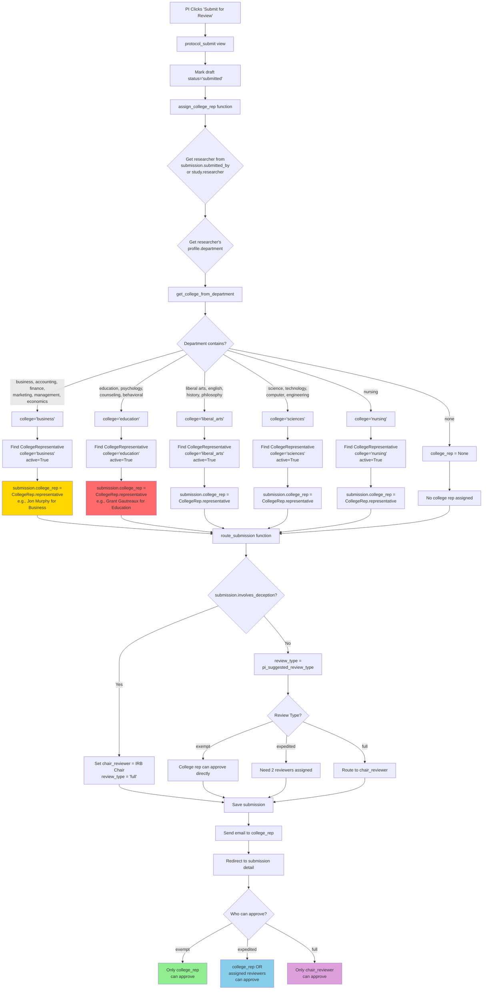

# Protocol Submission Flow Diagram

## Mermaid Diagram: What Happens When a PI Submits a Protocol

## Why Jon Murphy Cannot Approve the EI Protocol

**The Problem:**

Jon Murphy is the **College of Business Administration** representative. The EI (Emotional Intelligence) protocol is likely assigned to a **different college rep** because:

1. **Department Mapping**: The `assign_college_rep` function maps the PI's department to a college:
   - If the PI's department contains "psychology", "education", "counseling", or "behavioral" → maps to **College of Education**
   - If the PI's department contains "business", "management", "economics" → maps to **College of Business**

2. **EI Study PI**: The Emotional Intelligence study PI likely has a department that maps to **Education** (e.g., Psychology), not Business.

3. **College Rep Assignment**: The EI protocol gets assigned to the **Education college rep** (e.g., Grant Gautreaux), not Jon Murphy (Business).

4. **Approval Permissions**: 
   - For **exempt** protocols: Only the assigned `college_rep` can approve
   - For **expedited**: `college_rep` OR assigned reviewers can approve
   - For **full**: Only `chair_reviewer` can approve

**Solution:**

To allow Jon Murphy to approve the EI protocol, you need to either:

1. **Reassign the college rep** (if appropriate): Change `submission.college_rep` to Jon Murphy in the database or admin
2. **Change the PI's department**: Update the PI's profile department to something that maps to Business
3. **Assign Jon as a reviewer**: For expedited reviews, assign Jon Murphy as one of the reviewers
4. **Override in code**: Add logic to allow cross-college approvals for specific cases
