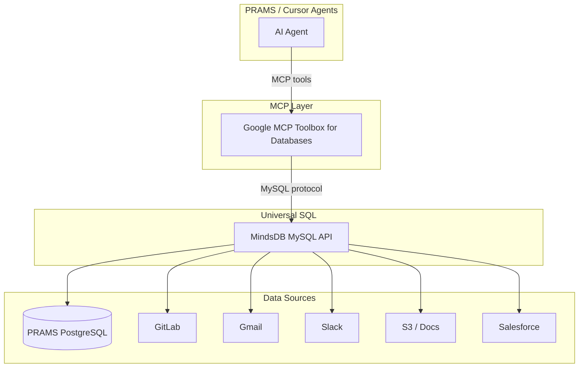

# PRAMS MCP Data Layer — Roadmap

PRAMS AI agents (IRB review, protocol assistance) currently read from Django/PostgreSQL only. Most institutional knowledge lives elsewhere: email, Slack, GitLab, Salesforce, S3, Jira, and internal docs.

This document describes the planned **universal SQL data layer** using **MindsDB** + **Google MCP Toolbox for Databases**.

## Architecture



## Why this stack

| Component | Role |
|-----------|------|
| **Google MCP Toolbox for Databases** | Open-source MCP server; agents call SQL tools securely over MCP |
| **MindsDB** | Universal SQL layer over 200+ sources; exposes everything as MySQL |
| **PRAMS PostgreSQL** | Primary app database (participants, studies, IRB records) |

From the agent's perspective: run SQL, get context back. The agent does not need to know whether rows came from GitLab, Gmail, or PRAMS.

## Capabilities unlocked

- **One SQL interface** for PRAMS DB + GitLab issues/MRs + institutional docs
- **Cross-source joins** — e.g. link open GitLab MRs to IRB protocol submissions
- **Unstructured data** — MindsDB ML handlers for emails, PDFs, review text
- **Simple MCP tools, expanded reach** — same Cursor/PRAMS agent config, more context

## Phase 1 — Local dev stack (now)

Start MindsDB + MCP Toolbox alongside PRAMS:

```bash
docker compose -f docker-compose.mcp.yml up -d
```

Files:

- `docker-compose.mcp.yml` — MindsDB + MCP Toolbox services
- `.cursor/mcp.json` — Cursor MCP server entries (Toolbox + existing Railway)

Configure MindsDB to connect PRAMS PostgreSQL:

```sql
CREATE DATABASE prams
WITH ENGINE = 'postgres',
PARAMETERS = {
  "host": "db",
  "port": 5432,
  "database": "recruitment_db",
  "user": "postgres",
  "password": "postgres"
};
```

## Phase 2 — GitLab + docs (next)

Connect institutional sources PRAMS agents need most:

1. **GitLab** — MRs, issues, pipeline status for deploy approval context
2. **S3 / Google Drive** — IRB PDFs, protocol attachments
3. **Email (SMTP/IMAP)** — PI correspondence (scrub PII in agent prompts; FERPA)

Example cross-source query (conceptual):

```sql
SELECT
  s.title AS study_title,
  g.title AS open_mr_title,
  g.state AS mr_state
FROM prams.studies_study s
JOIN gitlab.merge_requests g
  ON g.description ILIKE CONCAT('%', s.slug, '%')
WHERE g.state = 'opened';
```

## Phase 3 — Production (campus/cloud)

- Run MindsDB on an internal network segment (not public internet).
- MCP Toolbox binds to localhost; Cursor/agents connect via VPN or SSH tunnel.
- Read-only DB credentials for agent queries; no write access to production PRAMS via MCP unless explicitly approved.
- Audit log all agent SQL (MindsDB query log + PRAMS AuditLog).

## Security & FERPA

- **Never** expose student PII through MindsDB to agents without RBAC views (anonymized exports only).
- Use `PARTICIPANT_EXPORT_SALT` patterns for cross-system linkage.
- Prefer read replicas or views that strip direct identifiers.
- MCP Toolbox: restrict tools to `query` only; disable DDL.

## Cursor MCP configuration

See `.cursor/mcp.json`. After starting the stack:

```json
{
  "mcpServers": {
    "prams-database": {
      "command": "npx",
      "args": ["-y", "@google-cloud/mcp-toolbox-databases", "--prebuilt", "postgres", "--stdio"],
      "env": {
        "POSTGRES_HOST": "127.0.0.1",
        "POSTGRES_PORT": "5432",
        "POSTGRES_DATABASE": "recruitment_db",
        "POSTGRES_USER": "postgres",
        "POSTGRES_PASSWORD": "postgres"
      }
    },
    "mindsdb": {
      "command": "npx",
      "args": ["-y", "@google-cloud/mcp-toolbox-databases", "--prebuilt", "mysql", "--stdio"],
      "env": {
        "MYSQL_HOST": "127.0.0.1",
        "MYSQL_PORT": "47335",
        "MYSQL_DATABASE": "mindsdb",
        "MYSQL_USER": "mindsdb",
        "MYSQL_PASSWORD": ""
      }
    }
  }
}
```

Adjust host/port to match `docker-compose.mcp.yml`. Prebuilt names may change as Google releases updates — check [MCP Toolbox for Databases](https://github.com/googleapis/genai-toolbox) docs.

## References

- [Google MCP Toolbox for Databases](https://github.com/googleapis/genai-toolbox) (open source)
- [MindsDB](https://github.com/mindsdb/mindsdb) — universal SQL over federated sources
- PRAMS deploy: [PRAMS_CLOUD_GITLAB_DEPLOY.md](./PRAMS_CLOUD_GITLAB_DEPLOY.md)
