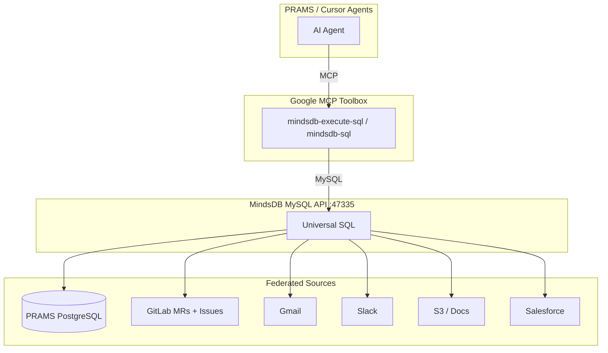

# PRAMS MCP Data Layer

PRAMS AI agents (IRB review, protocol assistance, deploy approval) need more than PostgreSQL. Institutional knowledge lives in GitLab MRs, email, Slack, docs, and CRM systems.

This stack gives agents **one SQL interface** over all of it:

1. **MindsDB** — universal SQL layer over 200+ sources (PostgreSQL, GitLab, Gmail, S3, Salesforce, …)
2. **Google MCP Toolbox for Databases** — MCP server so Cursor/agents run SQL securely via `mindsdb-execute-sql`

MindsDB exposes federated sources through its **MySQL API** (port 47335). MCP Toolbox connects there; agents never need to know which backend served the rows.

## Architecture



## Quick start

```bash
cp config/mcp/env.mcp.template config/mcp/.env
# Set GITLAB_API_KEY and PRAMS_POSTGRES_* as needed

./scripts/mcp-start.sh
```

Then enable **`prams-mindsdb`** in `.cursor/mcp.json`. Cursor loads Google's prebuilt MindsDB tools automatically.

| Endpoint | URL |
|----------|-----|
| MindsDB editor | http://127.0.0.1:47334 |
| MySQL API | 127.0.0.1:47335 (user `mindsdb`, no password) |

## MCP Toolbox configuration

Official prebuilt: `--prebuilt=mindsdb` ([docs](https://mcp-toolbox.dev/integrations/mindsdb/prebuilt-configs/mindsdb/))

Required environment variables:

| Variable | Default | Purpose |
|----------|---------|---------|
| `MINDSDB_HOST` | `127.0.0.1` | MindsDB host |
| `MINDSDB_PORT` | `47335` | MySQL wire port |
| `MINDSDB_DATABASE` | `mindsdb` | Database name |
| `MINDSDB_USER` | `mindsdb` | Username |
| `MINDSDB_PASS` | *(empty)* | Password |

Tools exposed to agents:

- **`mindsdb-execute-sql`** — run SQL across all connected sources
- **`mindsdb-sql`** — parameterized SQL (safer for production)

Direct PRAMS PostgreSQL (without federation) is also available via **`prams-postgres`** (`--prebuilt=postgres`) in `.cursor/mcp.json`.

## Federated sources (PRAMS defaults)

`scripts/mcp-bootstrap.sh` registers:

### PRAMS PostgreSQL → `prams_postgres`

```sql
CREATE DATABASE IF NOT EXISTS prams_postgres
WITH ENGINE = 'postgres',
PARAMETERS = {
  "host": "host.docker.internal",
  "port": 5432,
  "database": "recruitment_db",
  "user": "postgres",
  "password": "postgres"
};
```

### GitLab → `prams_gitlab`

Requires `GITLAB_API_KEY` in `config/mcp/.env`.

```sql
CREATE DATABASE IF NOT EXISTS prams_gitlab
WITH ENGINE = 'gitlab',
PARAMETERS = {
  "repository": "chriscastille/prams",
  "api_key": "your-token",
  "url": "https://gitlab.nicholls.edu"
};
```

Tables: `merge_requests`, `issues`.

### Adding more sources

MindsDB supports 200+ integrations. Examples:

```sql
-- Gmail
CREATE DATABASE prams_gmail
WITH ENGINE = 'gmail',
PARAMETERS = {"username": "...", "password": "..."};

-- Slack
CREATE DATABASE prams_slack
WITH ENGINE = 'slack',
PARAMETERS = {"token": "xoxb-..."};

-- S3
CREATE DATABASE prams_s3
WITH ENGINE = 's3',
PARAMETERS = {"aws_access_key_id": "...", "aws_secret_access_key": "...", "bucket": "..."};
```

See [MindsDB integrations](https://docs.mindsdb.com/integrations/data-integrations/all-data-integrations).

## Cross-source queries

Example: open GitLab MRs alongside PRAMS studies ([full list](../config/mcp/example-queries.sql)):

```sql
SELECT
  s.id AS study_id,
  s.title AS study_title,
  mr.title AS mr_title,
  mr.state AS mr_state
FROM prams_postgres.studies_study s
JOIN prams_gitlab.merge_requests mr
  ON mr.description LIKE CONCAT('%', s.slug, '%')
WHERE mr.state = 'opened';
```

This is the pattern from the MCP Toolbox + MindsDB demo: one SQL call, multiple enterprise sources, no ETL pipeline.

## Capabilities

- **One SQL interface** for PRAMS DB + GitLab + email + docs
- **Cross-datasource joins** — link deploy MRs to IRB protocol submissions
- **ML on unstructured data** — MindsDB handlers for text/PDF when needed
- **Simple MCP tools, massive reach** — two tools (`execute-sql`, `sql`) cover everything

## Rollout phases

| Phase | Scope | Status |
|-------|-------|--------|
| **1 — Local dev** | MindsDB + bootstrap + Cursor MCP | ✅ `docker-compose.mcp.yml`, scripts |
| **2 — GitLab + docs** | MR/issue federation, S3 IRB PDFs | 🔜 set `GITLAB_API_KEY`, add S3 handler |
| **3 — Production** | Internal network, read-only creds, audit | Planned |

## Security & FERPA

- **Never** expose student PII to agents without anonymized views.
- Use Django export salt (`PARTICIPANT_EXPORT_SALT`) for cross-system linkage.
- Prefer read replicas and views that strip direct identifiers.
- Restrict MCP to **SELECT** queries; no DDL via agents.
- Log agent SQL (MindsDB + PRAMS AuditLog) in production.

## References

- [Google MCP Toolbox for Databases](https://github.com/googleapis/mcp-toolbox) (formerly genai-toolbox)
- [MCP Toolbox MindsDB prebuilt](https://mcp-toolbox.dev/integrations/mindsdb/prebuilt-configs/mindsdb/)
- [MindsDB + MCP Toolbox announcement](https://medium.com/mindsdb/mindsdb-supercharges-googles-mcp-toolbox-with-unstructured-data-support-969792a9febc)
- [MindsDB GitLab integration](https://docs.mindsdb.com/integrations/app-integrations/gitlab)
- PRAMS deploy: [PRAMS_CLOUD_GITLAB_DEPLOY.md](./PRAMS_CLOUD_GITLAB_DEPLOY.md)
