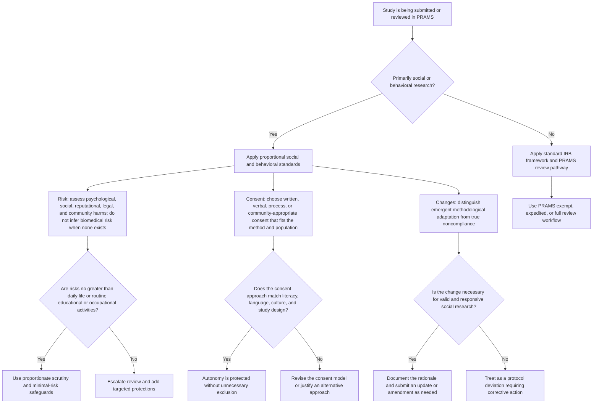
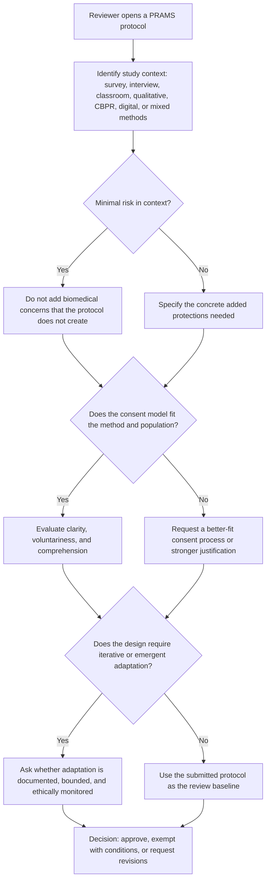

# Social Science IRB Standards for PRAMS

PRAMS supports many studies that are social, behavioral, educational, qualitative, or community-engaged rather than biomedical. This guide gives submitters and reviewers a shared mental model for applying the right standards to those studies. The goal is not to lower protections. The goal is to apply protections proportionately and contextually so minimal-risk social science research is not evaluated as if it were a clinical intervention.

The literature you provided points to three recurring problems when biomedical frameworks are applied too rigidly to social and behavioral research: risk is often overstated, written consent is treated as the default even when it does not fit the method or population, and emergent methodological adjustments are treated as compliance failures rather than as part of responsible research practice. This guide is designed to reduce those mismatches while preserving participant protection, respect, and accountability.

## Diagram 1: Which Standards Apply?

## Diagram 2: Reviewer Checklist for Social and Behavioral Studies

## For Submitters

- Name the study context clearly. Say if the study is survey-based, qualitative, classroom-based, community-engaged, observational, or another social and behavioral design.
- Describe the actual risks created by the study. Include psychological, social, reputational, legal, and community-level risks when relevant, not only physical risks.
- If the study is minimal risk, explain why the procedures are no riskier than normal daily life or routine educational or occupational activities for that population.
- Use a consent process that fits the method. If written consent is impractical or culturally inappropriate, justify verbal, process-based, or community-appropriate consent.
- If the design is iterative or emergent, say so up front. Explain what kinds of changes may occur, what will stay fixed, and how you will document and report meaningful changes.
- Avoid framing every adjustment as a failure. PRAMS still needs amendments or updates where required, but methodological responsiveness can be ethically appropriate.

## For Reviewers

- Start with the actual study design, not a biomedical default. Ask what harms are realistically created by this protocol.
- Do not overestimate risk just because the protocol involves human subjects. Many PRAMS studies are minimal-risk social and behavioral studies.
- Evaluate consent for fit, comprehension, and voluntariness. Written consent is one option, not the only ethically acceptable model in every social science context.
- Distinguish between justified methodological adaptation and noncompliance. Iterative qualitative or community-based work may require bounded flexibility.
- When requesting revisions, ask for targeted protections tied to the actual risks rather than generic biomedical safeguards.
- Keep proportionality in view: stronger oversight when risk truly increases, lighter oversight when participant protections are already appropriate to a minimal-risk design.

## Note for chairs and administrators: common social-science practices

**Course credit and bonus points.** In psychology, business, and other social-science departments, offering course credit or bonus points for research participation is a standard, widely accepted practice at many universities. For minimal-risk studies (e.g., surveys, behavioral tasks, vignette-based research), these incentives are generally not considered coercive when participation is voluntary, alternatives to participation are available per course policy, and the study has been approved as minimal risk. Treating such incentives as inherently problematic can block the very research that disciplinary norms and federal guidance allow, and can place the institution at odds with common practice elsewhere without a proportionate benefit to participants.

**Convenience sampling.** Recruiting from student participant pools or other readily accessible populations (convenience sampling) is common in social and behavioral research, especially in early-stage, classroom, and lab-based work. It is a methodological choice with known limits for generalizability, not an ethical shortcoming by itself. Reviewers and administrators should not treat convenience sampling alone as a reason to withhold or condition approval for minimal-risk protocols. Where generalizability is a scientific concern, it belongs in the discussion of study limitations, not as an IRB barrier [1], [2].

**Balancing oversight with academic freedom.** The aim of ethics review is to protect participants and support responsible research. When standards are applied so strictly or so misaligned with disciplinary norms that they routinely delay or prevent legitimate, low-risk social and behavioral research, the institution risks undermining academic freedom and the ability of researchers to conduct work that is standard in their field. Guidance that helps reviewers apply proportionate standards—and that names common practices such as course credit and convenience sampling as acceptable in the minimal-risk context—supports both protection and scholarship.

## Key terms for reviewers (recommended shared language)

**Convenience sampling vs. "sample of convenience."** Use "convenience sampling" as the neutral methodological term. It means participants are recruited from an accessible pool (for example, enrolled students), often for feasibility or early-stage evidence building. Do not treat the phrase "sample of convenience" as shorthand for poor ethics or invalid work. The correct question is whether the sample is appropriate for the study's stated claims. If claims are narrow (for example, student perceptions of a classroom exercise), student samples are often appropriate; if claims are broader, reviewers should require claim-bounding language rather than imposing a clinical-trial standard [1], [2].

**Pedagogical research / scholarship of teaching and learning (SoTL).** Classroom-focused studies of teaching practices, engagement, or student perceptions are often minimal risk and frequently qualify for exempt review categories when regulatory criteria are met (for example, normal educational practices and low-risk educational tests/surveys) [3]. These studies are not automatically "experiments" in the randomized controlled trial (RCT) sense. Rigor should match purpose and risk: clear questions, transparent methods, limitations, and appropriate analysis are expected; RCT-level design is not required for every educational inquiry [4], [5].

**Pilot, feasibility, and quality-improvement style work.** Early runs are often intended to test logistics, item clarity, instructional flow, or acceptability before confirmatory hypothesis tests. Reviewers should evaluate whether the protocol correctly labels this stage and whether interpretation remains bounded. Distinguish research purpose and logic explicitly: exploratory work (often inductive or abductive) is used to generate/refine questions and mechanisms; confirmatory work (typically deductive) is used to test prespecified hypotheses. A pilot can be rigorous without being confirmatory or randomized: rigor at this stage means transparent aims, fit-for-purpose methods, clear limits on causal claims, and documented learning for protocol improvement. "Not yet publication-ready as causal evidence" does not mean "ethically noncompliant." Pilot imperfections are expected and should trigger documentation, retraining, and amendment if needed [4], [5].

**Adverse event (AE) in social/behavioral/educational studies.** Reserve "adverse event" for participant harms or incidents that are unexpected, study-related (or possibly study-related), and suggest greater risk than previously recognized. In the U.S. framework, unanticipated problems involving risks to participants or others are the key reporting category [6]. By contrast, missed data collection, instrument administration errors, scheduling failures, or implementation mistakes without participant harm are typically protocol/operations issues, not AEs. Example: if students complete an exercise but a planned anonymous follow-up survey is not administered, that is usually a data-collection/protocol execution issue to document and correct, not an AE. These issues are usually handled internally (document, correct, retrain, amend if needed), with PI oversight and IRB notification when thresholds in policy are met [6].

**PI accountability and team learning.** The PI remains responsible for team conduct, corrective actions, and communication with the IRB. Teams should have room to identify and correct operational mistakes without treating every non-ideal execution as misconduct or participant harm. Good oversight means timely documentation, proportionate response, and escalation when participant risk actually changes.

## PRAMS Review Notes

- Use this guide alongside the existing PRAMS exempt, expedited, and full review workflow.
- This guide does not replace HSIRB authority, institutional policy, or federal requirements.
- It is intended to improve fit between the ethical review process and the realities of social and behavioral research conducted through PRAMS.

## Selected references

[1] Bornstein, M. H., Jager, J., & Putnick, D. L. (2013). Sampling in developmental science: Situations, shortcomings, solutions, and standards. *Developmental Review, 33*(4), 357-370.

[2] Etikan, I., Musa, S. A., & Alkassim, R. S. (2016). Comparison of convenience sampling and purposive sampling. *American Journal of Theoretical and Applied Statistics, 5*(1), 1-4.

[3] U.S. Department of Health and Human Services. 45 CFR 46.104(d) Exempt research categories (including educational settings/practices and surveys/interviews, as applicable).

[4] Shadish, W. R., Cook, T. D., & Campbell, D. T. (2002). *Experimental and quasi-experimental designs for generalized causal inference*. Houghton Mifflin.

[5] Felten, P. (2013). Principles of good practice in SoTL. *Teaching & Learning Inquiry, 1*(1), 121-125.

[6] Office for Human Research Protections (OHRP). (2007). *Guidance on reviewing and reporting unanticipated problems involving risks to subjects or others and adverse events*.

[7] American Psychological Association. IRBs and psychological science: A helpful primer for researchers. https://www.apa.org/research-practice/conduct-research/irbs-psych-science
