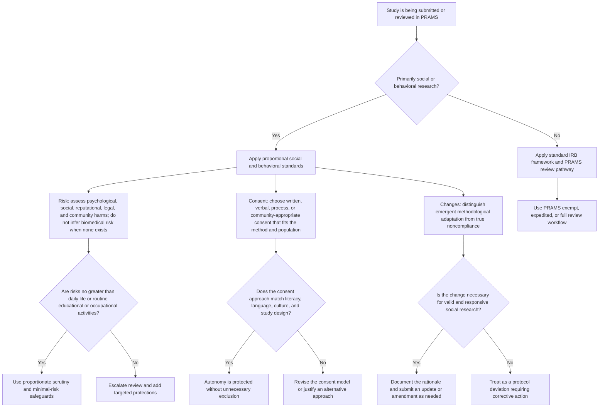
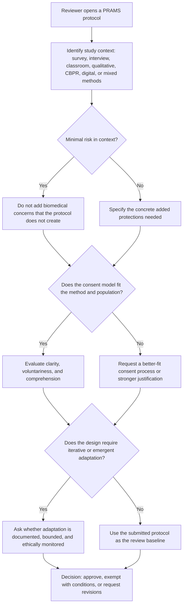

# Social Science IRB Standards for PRAMS

PRAMS supports many studies that are social, behavioral, educational, qualitative, or community-engaged rather than biomedical. This guide gives submitters and reviewers a shared mental model for applying the right standards to those studies. The goal is not to lower protections. The goal is to apply protections proportionately and contextually so minimal-risk social science research is not evaluated as if it were a clinical intervention.

The literature you provided points to three recurring problems when biomedical frameworks are applied too rigidly to social and behavioral research: risk is often overstated, written consent is treated as the default even when it does not fit the method or population, and emergent methodological adjustments are treated as compliance failures rather than as part of responsible research practice. This guide is designed to reduce those mismatches while preserving participant protection, respect, and accountability.

## Diagram 1: Which Standards Apply?

## Diagram 2: Reviewer Checklist for Social and Behavioral Studies

## For Submitters

- Name the study context clearly. Say if the study is survey-based, qualitative, classroom-based, community-engaged, observational, or another social and behavioral design.
- Describe the actual risks created by the study. Include psychological, social, reputational, legal, and community-level risks when relevant, not only physical risks.
- If the study is minimal risk, explain why the procedures are no riskier than normal daily life or routine educational or occupational activities for that population.
- Use a consent process that fits the method. If written consent is impractical or culturally inappropriate, justify verbal, process-based, or community-appropriate consent.
- If the design is iterative or emergent, say so up front. Explain what kinds of changes may occur, what will stay fixed, and how you will document and report meaningful changes.
- Avoid framing every adjustment as a failure. PRAMS still needs amendments or updates where required, but methodological responsiveness can be ethically appropriate.

## For Reviewers

- Start with the actual study design, not a biomedical default. Ask what harms are realistically created by this protocol.
- Do not overestimate risk just because the protocol involves human subjects. Many PRAMS studies are minimal-risk social and behavioral studies.
- Evaluate consent for fit, comprehension, and voluntariness. Written consent is one option, not the only ethically acceptable model in every social science context.
- Distinguish between justified methodological adaptation and noncompliance. Iterative qualitative or community-based work may require bounded flexibility.
- When requesting revisions, ask for targeted protections tied to the actual risks rather than generic biomedical safeguards.
- Keep proportionality in view: stronger oversight when risk truly increases, lighter oversight when participant protections are already appropriate to a minimal-risk design.

## Note for chairs and administrators: common social-science practices

**Course credit and bonus points.** In psychology, business, and other social-science departments, offering course credit or bonus points for research participation is a standard, widely accepted practice at many universities. For minimal-risk studies (e.g., surveys, behavioral tasks, vignette-based research), these incentives are generally not considered coercive when participation is voluntary, alternatives to participation are available per course policy, and the study has been approved as minimal risk. Treating such incentives as inherently problematic can block the very research that disciplinary norms and federal guidance allow, and can place the institution at odds with common practice elsewhere without a proportionate benefit to participants.

**Convenience sampling.** Recruiting from student participant pools or other readily accessible populations (convenience sampling) is the default in much of social and behavioral research. It is a methodological choice with known limits for generalizability, not an ethical shortcoming. Reviewers and administrators should not treat convenience sampling alone as a reason to withhold or condition approval for minimal-risk protocols. Where generalizability is a scientific concern, it belongs in the discussion of study limitations, not as an IRB barrier.

**Balancing oversight with academic freedom.** The aim of ethics review is to protect participants and support responsible research. When standards are applied so strictly or so misaligned with disciplinary norms that they routinely delay or prevent legitimate, low-risk social and behavioral research, the institution risks undermining academic freedom and the ability of researchers to conduct work that is standard in their field. Guidance that helps reviewers apply proportionate standards—and that names common practices such as course credit and convenience sampling as acceptable in the minimal-risk context—supports both protection and scholarship.

## PRAMS Review Notes

- Use this guide alongside the existing PRAMS exempt, expedited, and full review workflow.
- This guide does not replace HSIRB authority, institutional policy, or federal requirements.
- It is intended to improve fit between the ethical review process and the realities of social and behavioral research conducted through PRAMS.
