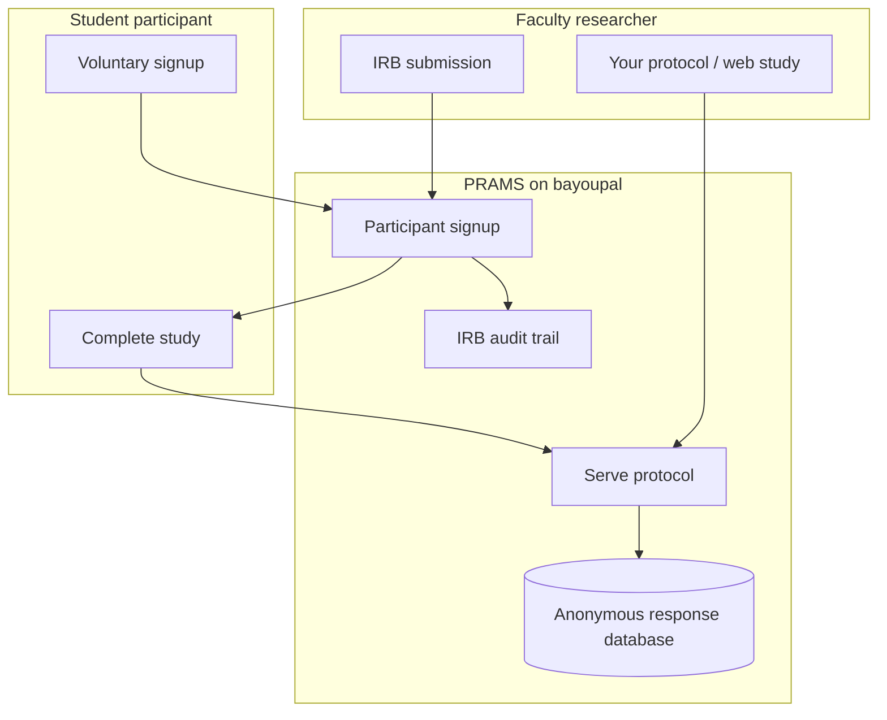

# PRAMS Guide for Deans and Department Heads

**Audience:** College deans, department heads, program coordinators  
**One-page version:** [DEAN_AND_CHAIR_ONE_PAGER.md](DEAN_AND_CHAIR_ONE_PAGER.md) ← **start here**  
**Institution:** Nicholls State University  
**Purpose:** Explain what PRAMS is, what it means for faculty research, and why leadership should not be alarmed  
**Shorter versions:** [DR_YOUNG_BRIEFING_SCRIPT.md](DR_YOUNG_BRIEFING_SCRIPT.md) (30 sec) | [NICHOLLS_AI_USE_INVENTORY.md](NICHOLLS_AI_USE_INVENTORY.md) (IT)  
**Date:** July 2026

---

## In one minute

**PRAMS** is Nicholls-built software that helps faculty:

1. **Recruit student participants** for IRB-approved research (replacing SONA)
2. **Host research protocols** (your lab’s web-based studies) on **Nicholls servers**
3. **Track IRB compliance** — approvals, consent, participation — in one place

It is **not** a student grades system, **not** a general AI chatbot, and **not** a commercial cloud product sending data to advertisers.

Student **experiment responses** are stored **anonymously** when PRAMS runs without course credit. The system is reviewed through **bayouops GitLab and IT** before it goes live on **bayoupal.nicholls.edu**.

---

## Why you are hearing about this now

Three conversations are happening at once on campus. They sound related but are different — see **[LOUISIANA_AI_FERPA_COMPLIANCE_STACK.md](LOUISIANA_AI_FERPA_COMPLIANCE_STACK.md)** for the full layered picture.

| Conversation | What it is really about | Should deans worry? |
|--------------|-------------------------|-------------------|
| **FERPA / student privacy** | Keeping identifiable academic records private | **Low** if studies are voluntary and not for credit |
| **Governor EO 25-103 / 25-109** | No hostile foreign AI (DeepSeek); CIO approval; no **sensitive** data in AI; dataset cleansing | **Low** if PRAMS stays on bayoupal, AI off or Ollama-only, IT-reviewed |
| **Board of Regents (Oct 2025)** | Responsible, ethical, secure AI in public higher ed | **Low** — documented inventory; campus policy pending |
| **HR 320 (2025)** | Promote AI **education** for students and faculty development | **Opportunity** — not a ban on research tools |
| **National news (SNHU, etc.)** | Student portals leaking GPA to Google/TikTok | **Not applicable** |

Administration’s concern is often **impression management**: *Can we defend this if the Governor’s office, Board of Regents, or a parent asks?*  

**Answer:** Yes — if we describe it as **faculty research infrastructure reviewed by IT**, not as “professors experimenting with ChatGPT on students.”

---

## What PRAMS does (faculty view)

### For department heads — practical translation

| Old workflow (SONA / manual) | PRAMS workflow |
|------------------------------|----------------|
| Commercial SONA account (~$2K) | Nicholls-hosted alternative |
| Protocol hosted separately | Protocol can live **inside PRAMS** (`templates/projects/{study}/`) |
| Paper or email signups | Online signup with **consent snapshot** |
| Spreadsheet of participants | Secure roster for researchers; **anonymous** data table for results |
| IRB paperwork scattered | Study approval status, submissions, audit log in one system |

---

## What PRAMS stores — and what it does not

This is the most important section for deans briefing faculty.

### Two kinds of data (kept separate on purpose)

See **[STUDENT_DATA_TAXONOMY.md](STUDENT_DATA_TAXONOMY.md)** for the full three-tier framework (student-generated · student-linked · synthetic/de-identified).

| Type | Tier | Examples | Who sees it | FERPA sensitivity |
|------|------|----------|-------------|-------------------|
| **Student-generated content** | I | Essay, survey text, task responses | Researcher via **anonymous** export | Depends on whether student put PII in the text |
| **Scheduling / participation** | II | Who signed up, attended, consented | Study researcher, IRB (as needed) | **Higher** if linked to course credit |
| **Synthetic / de-identified** | III | Demo data, anonymous response DB, salted export IDs | Dev, reporting, analysis | **Lowest** when fully synthetic or properly de-linked |

**Key design point:** When a student completes your protocol, their answers go into a **response database keyed by a random session ID** — not by name or student ID. That is intentional and documented for IRB and FERPA review.

### Default mode: no course credit (recommended)

| With course credit | Without course credit (default) |
|--------------------|----------------------------------|
| Participation may affect grades | **Voluntary** research only |
| Enrollment and credits tracked | Credit tracking **off** |
| Broader FERPA footprint | **Reduced** privacy scope |
| Needed only if your college uses research credit | **Sufficient for most lab studies** |

**Dean talking point:** *“Our default is voluntary research participation. We are not tying PRAMS to the gradebook unless a program explicitly needs research credit.”*

---

## AI: what deans need to know (plain language)

Nicholls does **not** yet have a campus-wide AI policy. Leadership is cautious because of **Louisiana executive orders** and **Board of Regents** direction. Here is what actually applies to PRAMS:

| Question | Answer for your faculty meeting |
|----------|--------------------------------|
| Do students use AI in PRAMS? | **No** |
| Does PRAMS send student data to ChatGPT? | **No** — not in normal operation |
| Is DeepSeek or foreign AI used? | **No** — banned platforms are not in the stack |
| Was AI used to **build** the software? | Yes — standard development tools (like an advanced code editor). **No real student data** was used in that process. |
| Is there any AI in production? | **Optional** tool for IRB staff to review protocol *text* — can run on **Nicholls server only** or be **turned off entirely** |
| Should faculty paste student names into any AI tool? | **Never** — not Cursor, not ChatGPT, not PRAMS |

**Dean talking point:** *“This is research software on our server. It is not an AI product aimed at students. Optional admin AI can be disabled until campus policy is ready.”*

---

## Louisiana and Board of Regents — dean-level framing

Full stack: **[LOUISIANA_AI_FERPA_COMPLIANCE_STACK.md](LOUISIANA_AI_FERPA_COMPLIANCE_STACK.md)**

| Source | Theme | PRAMS alignment |
|--------|-------|---------------|
| **EO JML 25-109** (Landry, Sep 2025) | No DeepSeek/hostile foreign AI; universities are targets; **CIO approval**; **no sensitive data in AI** | DeepSeek not used; bayouops path; AI off by default |
| **EO JML 25-103** (Aug 2025) | AI inventory; dataset **cleansing**; acquisition policies | [NICHOLLS_AI_USE_INVENTORY.md](NICHOLLS_AI_USE_INVENTORY.md); screener + synthetic dev |
| **Board of Regents** (Oct 2025) | Prohibit AI misuse harming **security/integrity**; encourage ethical research use | RBAC, RLS, violation-path docs |
| **HR 320** (2025, passed) | Promote AI **literacy** — not reckless AI on student data | Faculty teach AI; PRAMS protects data |
| **HB 1184** (2026, pending) | Ban foreign-adversary AI **procurement** | Watch; aligns with EO if enacted |

**One sentence for a college council agenda:**

> PRAMS is Nicholls-hosted faculty research infrastructure, reviewed by IT, that stores student experiment data anonymously and does not use banned foreign AI — with all optional AI features able to remain off until institutional policy is adopted.

---

## What faculty in your college need to do

### Do

- Submit studies through **IRB** as usual
- Host protocols on PRAMS once IT/bayouops approval is complete
- Use **informed consent** language provided or approved by IRB
- Keep protocols from collecting **names or student IDs** inside anonymous studies unless IRB explicitly requires it
- Contact the project lead for onboarding before going live

### Do not

- Put **grades, GPAs, or roster exports** into AI tools (any tool)
- Assume PRAMS replaces **Banner / academic records** — it does not
- Enable **course credit** in PRAMS without college + Registrar conversation
- Upload **real student data** to test protocols in development

---

## FAQ — questions deans and chairs actually ask

### “Is this shadow IT?”

**No.** Development includes IT involvement; code is submitted to **bayouops for GitLab review** before production deployment. The goal is formal institutional adoption, not a rogue professor website.

### “Can a parent or student sue us over this?”

Current FERPA law does **not** give students a private right to sue for damages. Enforcement is federal complaint-driven. The lawsuits in the news involve **different facts** (advertising trackers on student portals). PRAMS is self-hosted with access controls and anonymous research storage.

### “Does this replace SONA?”

**Yes, that is the intent** — with Nicholls control of data and protocols. Commercial SONA remains an option (~$2K) if the institution prefers a vendor.

### “What if my faculty member hosts a study with course credit?”

Possible, but **increases compliance scope** (enrollment, credits = education records). College should coordinate with IRB, Registrar, and IT before enabling credit mode.

### “Who can see participant names?”

**Study researchers** for studies they run (scheduling/roster). **Not** other faculty, not the public. Research **results** are anonymous by default.

### “What about my college’s existing protocols (EI-DK, conjoint, HR-SJT, etc.)?”

Those templates already live in the repository under `templates/projects/`. PRAMS is built to **host your college’s protocols** on bayoupal once approved.

### “What do you need from me as dean?”

1. **Awareness** — so you are not surprised if IT or Academic Affairs asks  
2. **Accurate faculty messaging** — research infrastructure, not “AI experiment”  
3. **Optional:** Identify one pilot department for post-approval rollout  
4. **Do not** require every chair to read technical docs — this page is enough

### “What do you need from department heads?”

1. Ensure faculty route studies through **IRB**  
2. Remind researchers: **voluntary, anonymous-by-design** unless credit mode is approved  
3. Direct technical questions to the project lead and IT — not gossip in hallways

---

## Rollout story (for college meetings)

| Phase | Status | Dean action |
|-------|--------|-------------|
| **Built** | Application and protocols in development | None — informational |
| **bayouops / IT review** | In progress | Support institutional review |
| **Pilot studies** | After IT sign-off | Nominate 1–2 faculty pilots if desired |
| **College-wide availability** | After pilot success | Announce via chair meeting |
| **Campus AI policy** | Pending Nicholls | PRAMS already has inventory; AI can stay off |

---

## Elevator scripts

### 15 seconds (hallway)

> PRAMS is our Nicholls-hosted SONA replacement. Faculty run IRB studies and host protocols on bayoupal. Student answers are anonymous. IT reviews it through bayouops. Not a ChatGPT thing.

### 45 seconds (department meeting)

> Several of our labs need a way to recruit participants and run web-based studies without paying for commercial SONA or hosting surveys on random websites. PRAMS does that on Nicholls servers. Students sign up voluntarily; their actual experiment data is stored without their name attached. The code is going through bayouops and IT like any institutional software. Louisiana’s AI orders are about foreign platforms and losing control of data — we kept everything on campus and can leave optional AI features off until the university adopts policy. I’m not asking you to learn the technology — just to know this is **approved-path research infrastructure**, not faculty going rogue with AI.

### Email subject line (forwarding to chairs)

> **FYI: PRAMS — Nicholls research participation system (IT-reviewed, not an AI student tool)**

---

## Who to contact

| Topic | Contact |
|-------|---------|
| PRAMS features, faculty onboarding | Project lead (Dr. Castille) |
| IT / bayouops / GitLab review | Nicholls IT / bayouops team |
| IRB requirements | Institutional IRB |
| Academic Affairs awareness | Dr. Kaisa Young, AVP Academic Affairs |
| Technical compliance detail | [FERPA_COMPLIANCE_MAPPING.md](FERPA_COMPLIANCE_MAPPING.md) (optional reading) |

---

## Document map (if someone wants more depth)

| Document | Best for |
|----------|----------|
| **This guide** | Deans, department heads, chairs |
| [DR_YOUNG_BRIEFING_SCRIPT.md](DR_YOUNG_BRIEFING_SCRIPT.md) | AVP Academic Affairs — 30-second script |
| [NICHOLLS_AI_USE_INVENTORY.md](NICHOLLS_AI_USE_INVENTORY.md) | bayouops / IT — AI inventory |
| [PRESIDENT_EXECUTIVE_BRIEF.md](PRESIDENT_EXECUTIVE_BRIEF.md) | President / executive leadership |
| [FERPA_COMPLIANCE_MAPPING.md](FERPA_COMPLIANCE_MAPPING.md) | Legal, IRB, IT auditors |

---

*PRAMS supports faculty scholarship and student protection. Deans and chairs do not need to master the technology — they need an accurate story for their colleges.*
