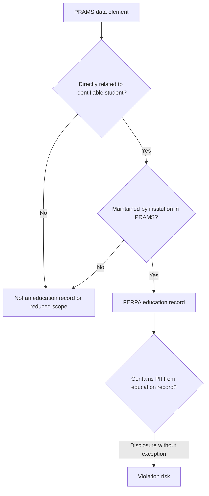

# FERPA Compliance Mapping for PRAMS

**System:** PRAMS (Participant Recruitment and Management System)  
**Last updated:** July 2026  
**Related corpus:** [ferpa_corpus.json](ferpa_corpus.json)  
**Prior audit:** [FERPA_AUDIT_REPORT.md](../../FERPA_AUDIT_REPORT.md)

This document maps authoritative FERPA sources to PRAMS data flows and technical controls. It supports IT, IRB, and legal review. **It is not legal advice.**

---

## 1. Legal Framework

### Statute and regulations

| Source | Role |
|--------|------|
| [20 U.S.C. § 1232g](https://www.law.cornell.edu/uscode/text/20/1232g) | Conditions federal funding on protecting education records |
| [34 CFR Part 99](https://www.ecfr.gov/current/title-34/subtitle-A/part-99) | Operational definitions, rights, permitted disclosures, recordkeeping |

### Court precedent (sparse but authoritative)

| Case | Holding | Corpus ID |
|------|---------|-----------|
| *Owasso v. Falvo*, 534 U.S. 426 (2002) | Peer-graded papers before teacher recording are not "maintained" education records | `owasso-2002` |
| *Gonzaga Univ. v. Doe*, 536 U.S. 273 (2002) | No private § 1983 suit for FERPA nondisclosure violations | `gonzaga-2002` |
| *U.S. v. Miami Univ.*, 294 F.3d 797 (6th Cir. 2002) | Disciplinary/enrollment records maintained by institution are education records | `miami-univ-2002` |
| *Bauer v. Kincaid*, 759 F. Supp. 575 (W.D. Mo. 1991) | Not all campus-held documents are education records | `bauer-1991` |
| *Hardin County Schools v. Foster*, 727 F. App'x 230 (6th Cir. 2018) | Education-record protection applies in litigation/discovery contexts | `hardin-county-2018` |

### Administrative enforcement (primary violation path)

FERPA violations are investigated by the **Student Privacy Policy Office (SPPO)** via complaints. Findings are published as redacted letters on [studentprivacy.ed.gov](https://studentprivacy.ed.gov/). These letters illustrate fact patterns but are **not binding precedent** and may not reflect current policy.

See [ferpa_corpus.json](ferpa_corpus.json) for curated SPPO entries (e.g., `sppo-husk-2006`, `sppo-middleton-2025`).

---

## 2. Education Record Definition

### Two-part test (34 CFR § 99.3; *Owasso*)

Information is a FERPA education record when **both** are true:

1. **Directly related** to a student (identifiable, not merely a name in isolation)
2. **Maintained** by the educational agency or institution (institutional custody, not transient peer-graded work)

Additionally, disclosure rules apply to **personally identifiable information** from such records.

### PRAMS design rules (from prior audit; now in corpus)

| Rule | Status in PRAMS |
|------|-----------------|
| Anonymous/ungraded student work may be processed without participant linkage | **PASS** — `Response` uses `session_id`, no participant FK |
| Do not combine student name with academic context in external AI without controls | **PARTIAL** — screener implemented; requires external-provider routing |
| Treat enrollment, attendance, performance, advising as FERPA-protected | **PARTIAL** — RBAC + RLS; audit gaps remain |
| When uncertain, assume FERPA applies | **PARTIAL** — AI agents updated; human review still required |
| Do not log full prompts with FERPA data outside institutional control | **PARTIAL** — hash-only audit for external providers |

---

## 3. What Constitutes a FERPA Violation

### Conclusive (well-settled)

A **regulatory FERPA violation** occurs when an educational agency or institution has a **policy or practice** of:

- Disclosing **personally identifiable information from education records** without prior written consent and without an applicable exception (20 U.S.C. § 1232g(b); 34 CFR §§ 99.30–99.33), or
- Failing to provide eligible students/parents access to their education records where required (34 CFR § 99.10), or
- Failing to maintain required disclosure logs (34 CFR § 99.32) in applicable circumstances.

**Enforcement:** SPPO investigation; possible federal funding withdrawal. **No private lawsuit** for nondisclosure under § 1983 (*Gonzaga*).

### Not conclusive (use "violation risk" language)

| Topic | Why unsettled | PRAMS implication |
|-------|---------------|-------------------|
| Email as education record | SPPO declined to adopt *Tulare* in Middleton 2025 finding | Email notifications are lower risk but not zero risk |
| Voluntary research without grade linkage | No Supreme Court case on research-recruitment platforms | No-credit mode reduces scope; document voluntariness |
| Third-party LLM processing | No direct precedent | Analyze as disclosure to non-school-official unless Ollama/contractor controls apply |
| IP addresses on anonymous responses | Indirect identifier theory | Store only if necessary; consider hashing (Finding M-1) |

---

## 4. PRAMS Data Inventory

### Mode A: With course credit (full FERPA scope)

| Data element | Model | Education record? | Legal basis |
|--------------|-------|-------------------|-------------|
| Course enrollment | `Enrollment` | **Yes** | Maintained enrollment status (*Miami Univ.*) |
| Research credits | `CreditTransaction` | **Yes** | Academic performance record |
| Study signup / attendance | `Signup` | **Yes** | Participation record maintained by institution |
| Prescreening answers | `PrescreenResponse` | **Yes** | Assessment data linked to identifiable student |
| Student ID, ban fields | `Profile` | **Yes** | Direct identifier + behavioral record |
| Consent snapshot | `Signup.consent_text_version` | **Yes** | Institutional participation record |
| Secondary data consent | `StudentDataConsent` | **Yes** | Consent for use of course-linked data |
| Anonymous protocol payload | `Response` | **No** | No participant FK; session-based anonymity (*Owasso* pattern) |
| Study metadata | `Study` | **No** | Not student-level data |
| IRB review / protocol | `IRBReview`, `ProtocolSubmission` | **No** | Researcher/protocol records |

### Mode B: Without course credit (reduced scope)

Per [FEDERAL_AUDIT_SURVIVAL_NO_CREDIT.md](../../FEDERAL_AUDIT_SURVIVAL_NO_CREDIT.md):

| Data element | FERPA treatment |
|--------------|-----------------|
| `CreditTransaction` | **Not used** — disable feature |
| Credit-linked `Enrollment` | **Not needed** — optional |
| `Signup` without grade linkage | **Voluntary research** — weaker education-record argument |
| `Response` | **Not an education record** (anonymous) |
| `Profile.student_id` | **PII** — minimize collection |
| `PrescreenResponse` | **Elevated risk** if linked to identifiable student — prefer anonymous prescreen or disable |

---

## 5. Control Matrix

| Legal requirement | PRAMS control | Code / config | Status |
|-------------------|---------------|---------------|--------|
| Restrict access to education records | RBAC (5 roles) | `apps/accounts/models.py` | **PASS** |
| Authenticate sensitive views | `@login_required` | `apps/studies/views.py`, `apps/courses/views.py`, `apps/reporting/views.py` | **PASS** |
| Prevent IDOR disclosure | Object scoping; 404 for unauthorized | `apps/studies/views.py` (`mark_attendance`) | **PASS** |
| Block privilege escalation | Self-registration → `participant` only | `apps/accounts/views.py` | **PASS** |
| Database-level isolation | PostgreSQL RLS + middleware | `apps/accounts/middleware.py`, `0023_rls_studies_signups.py` | **PASS** |
| Anonymize research responses | `Response.session_id`, no participant FK | `apps/studies/models.py` | **PASS** |
| Immutable audit for IRB/credits | `AuditLog` + `irb_audit_logs` triggers | `apps/credits/models.py`, signals, `0002_irb_audit_logs.py` | **PASS** |
| Log FERPA export access | CSV download logging | `apps/reporting/views.py` | **PASS** |
| De-identified export IDs | HMAC-SHA256 salted IDs | `config/export_utils.py` | **PASS** |
| Institutional AI option | Ollama provider | `apps/studies/irb_ai/agents/base.py` | **PASS** |
| Screen prompts before external AI | `FERPAPromptScreener` | `apps/studies/irb_ai/ferpa_screener.py` | **PASS** (see §6) |
| Audit AI API calls (hash-only external) | `log_ai_api_call` | `apps/studies/irb_ai/audit.py`, `base.py` | **PASS** (see §6) |
| Data retention / deletion | Automated purge | — | **FAIL** — no policy in code |
| At-rest encryption | Deployment-dependent | settings, deployment guides | **PARTIAL** |
| IP minimization on `Response` | Optional field | `apps/studies/models.py` | **PARTIAL** — field still present |
| FERPA-default AI agent instructions | System prompt additions | `apps/studies/irb_ai/agents/base.py` | **PASS** (see §6) |

---

## 6. AI / Third-Party Disclosure Controls

PRAMS IRB AI review can send protocol materials to external LLM providers. This creates **disclosure risk** if uploads contain identifiable student education records.

### Implemented mitigations

1. **`FERPAPromptScreener`** (`apps/studies/irb_ai/ferpa_screener.py`) — scans prompts for:
   - Student ID patterns
   - Grade / GPA / credit references combined with name-like tokens
   - Advising and assessment keywords in academic context
   - Blocks or redacts before external API calls; allows Ollama (institutional) with warnings

2. **`log_ai_api_call`** (`apps/studies/irb_ai/audit.py`) — writes to `AuditLog`:
   - Provider, model, agent name
   - SHA-256 hashes of prompt and response (not full content for external providers)
   - Screening result metadata

3. **FERPA-aware agent instructions** — base agent system prompt defaults to "assume FERPA applies" and flags identifiable student data.

### Residual risk

Institutions using OpenAI/Anthropic/Gemini should:
- Prefer **Ollama** (institutional control) for protocols that may reference student populations
- Prohibit uploads containing real student names, IDs, or grade data
- Review `AuditLog` entries with action `ai_api_call` during compliance audits

---

## 7. Approved Compliance Statements

### With course credit enabled

> PRAMS treats enrollment, credit transactions, signups, prescreening responses, and profile identifiers as FERPA education records per the *Miami Univ.* maintained-and-identifiable standard. Access is restricted by role, scoped at the view layer, and reinforced by PostgreSQL row-level security. Anonymous protocol responses are stored without participant linkage per the *Owasso* anonymization pattern.

### Without course credit

> When course credit and grade linkage are disabled, PRAMS does not maintain academic performance records or credit-bearing enrollment data. Voluntary research participation and anonymous `Response` payloads fall outside the core FERPA education-record definition relied on in *Owasso* and institutional IRB guidance. Baseline security controls and minimization of student identifiers still apply.

### AI / third-party disclosure

> PRAMS implements automated prompt screening and hash-based audit logging for IRB AI review. Institutions should route AI review through Ollama when protocol materials may reference identifiable student data. External LLM providers require institutional vendor review under 34 CFR § 99.31 school-official/contractor analysis.

---

## 8. Open Gaps and Remediation

| Finding | Severity | Remediation pointer |
|---------|----------|---------------------|
| C-5 No retention/deletion policy | HIGH | `SECURITY_COMPLIANCE_REMEDIATION_LIST.md`; implement management commands |
| M-1 IP on anonymous `Response` | MEDIUM | Evaluate necessity; hash or purge after 90 days |
| M-3 Study roster PII exposure | MEDIUM | Data minimization in `study_roster` view |
| M-4 Protocol submission access logging | MEDIUM | Add `AuditLog` on detail view access |
| At-rest encryption | MEDIUM | IT deployment requirement (PostgreSQL TDE, disk encryption) |

---

## 9. References

| Document | Audience |
|----------|----------|
| [DEAN_AND_CHAIR_GUIDE.md](DEAN_AND_CHAIR_GUIDE.md) | College deans, department heads, program coordinators |
| [NICHOLLS_AI_USE_INVENTORY.md](NICHOLLS_AI_USE_INVENTORY.md) | bayouops / IT — one-page AI use inventory for GitLab review |
| [DR_YOUNG_BRIEFING_SCRIPT.md](DR_YOUNG_BRIEFING_SCRIPT.md) | Dr. Kaisa Young (AVP Academic Affairs) — 30-second briefing script |
| [PRESIDENT_EXECUTIVE_BRIEF.md](PRESIDENT_EXECUTIVE_BRIEF.md) | President / executive leadership — board-ready summary |
| [ferpa_corpus.json](ferpa_corpus.json) | Legal — curated statute, cases, SPPO letters |
- [FERPA_AUDIT_REPORT.md](../../FERPA_AUDIT_REPORT.md) — February 2026 code audit
- [FEDERAL_AUDIT_SURVIVAL_NO_CREDIT.md](../../FEDERAL_AUDIT_SURVIVAL_NO_CREDIT.md) — no-credit deployment mode
- [IT_EXECUTIVE_COMPLIANCE_SUMMARY.md](../../IT_EXECUTIVE_COMPLIANCE_SUMMARY.md) — executive summary
- [SECURITY_COMPLIANCE_REMEDIATION_LIST.md](../../SECURITY_COMPLIANCE_REMEDIATION_LIST.md) — remediation tracker
- [scripts/build_ferpa_corpus.py](../../scripts/build_ferpa_corpus.py) — corpus update script

---

*Consult institutional General Counsel for contested questions (emails, cloud vendors, AI disclosures). This mapping supports documented controls and governance; it does not replace legal review.*
