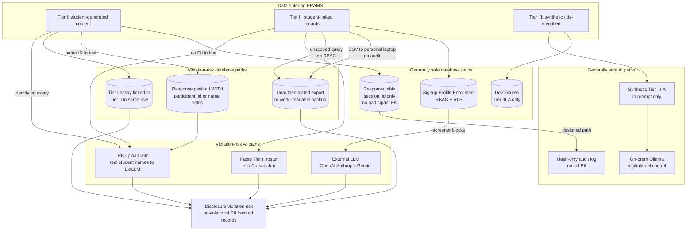
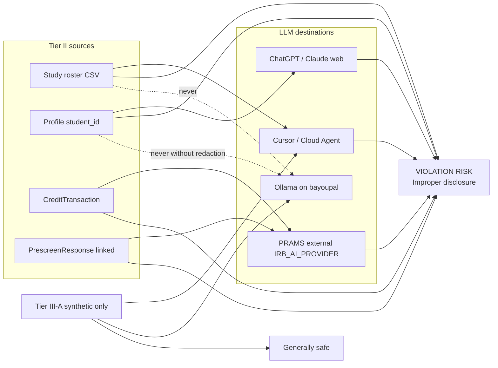
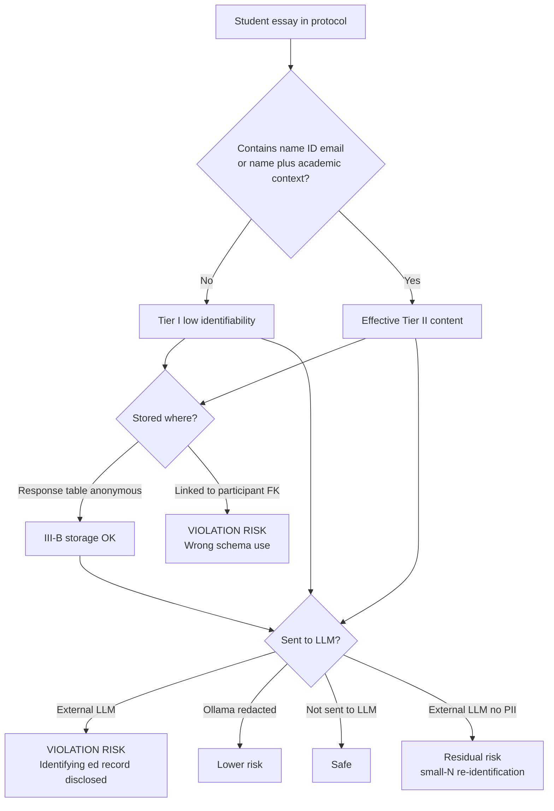
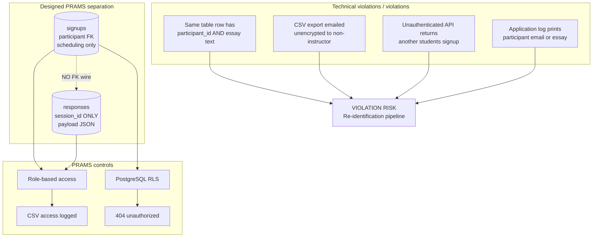
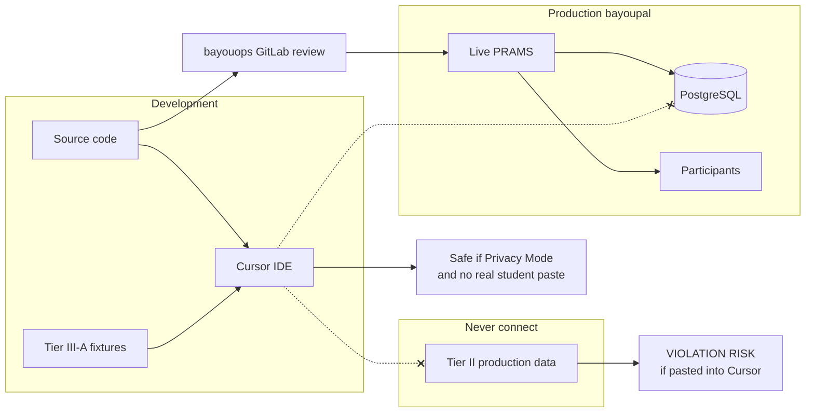
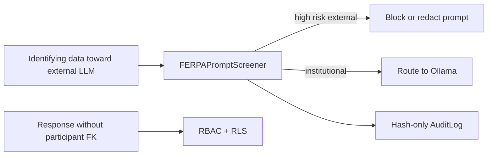
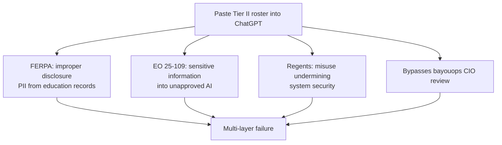

# Technical FERPA Violation Paths — PRAMS

**Purpose:** Name **concrete technical scenarios** that create FERPA violation **risk** or clear regulatory violations, with diagrams deans and IT can follow.  
**Louisiana layer:** [LOUISIANA_AI_FERPA_COMPLIANCE_STACK.md](LOUISIANA_AI_FERPA_COMPLIANCE_STACK.md) — Governor EOs, Regents, legislation stacked on FERPA  
**Audience:** Deans, department heads, IRB, IT, faculty, project lead  
**Data tiers:** [STUDENT_DATA_TAXONOMY.md](STUDENT_DATA_TAXONOMY.md) (Tier I / II / III)  
**Controls:** [FERPA_COMPLIANCE_MAPPING.md](FERPA_COMPLIANCE_MAPPING.md)

**Note:** “Violation” below means **regulatory FERPA improper disclosure** (34 CFR §§ 99.30–99.33) unless marked as **violation risk** (unsettled law, e.g. external LLM without vendor agreement).

---

## Regulatory test (technical translation)

A **FERPA violation** occurs when the institution has a **policy or practice** of:

> Disclosing **personally identifiable information (PII) from education records** without consent or a permitted exception.

For PRAMS, the technical questions are:

1. Is the data an **education record** (identifiable + maintained)?
2. Did it **leave institutional control** or reach an **unauthorized party**?
3. Was there a valid **exception** (school official, contractor under agreement, etc.)?

---

## Master diagram — safe vs violation paths

---

## Diagram 1 — Tier II touching an LLM

**Tier II** (name, student ID, email, enrollment, credit, linked prescreen) sent to any LLM outside institutional control is a **high-confidence violation risk** and often a **violation** if it constitutes PII from education records disclosed without consent/exception.

| Action | Verdict |
|--------|---------|
| Paste roster CSV into Cursor to “debug PRAMS” | **Violation risk** — Tier II to third-party AI |
| Export credits CSV to ChatGPT for “analysis” | **Violation risk** |
| IRB staff uploads protocol PDF containing **real student names** to OpenAI | **Violation risk** |
| Use **fake** student names in Cursor for dev | **Safe** (Tier III-A) |
| IRB review on **Ollama** with **redacted** protocol text | **Lower risk** — institutional control + Tier III-D |

**PRAMS control:** `FERPAPromptScreener` blocks many patterns to external providers; **default `IRB_AI_PROVIDER=ollama`** or disable AI.

---

## Diagram 2 — Tier I (student-generated) touching an LLM

Tier I is **not automatically safe**. If the essay or survey text **contains identifying information**, it is **PII from an education record** once maintained by the institution.

| Scenario | Verdict |
|----------|---------|
| Anonymous `Response.payload` — no names in JSON | **Generally safe** storage; caution on external LLM |
| Student types full name in open-ended box → stored in `Response` | **Education record content** — treat as sensitive |
| Researcher copies identifying essays into ChatGPT to “code themes” | **Violation risk** |
| Synthetic lorem ipsum essay in Cursor | **Safe** |

**Faculty rule:** Protocol instructions must say **do not enter your name or student ID** in response fields.

---

## Diagram 3 — Database paths (what must not happen)

| Technical failure | FERPA issue | PRAMS status |
|-------------------|-------------|--------------|
| `Response` row includes `participant_id` | Breaks anonymization — **violation risk** | **Not in schema** — by design |
| Researcher without scope views another study’s signups | Improper disclosure | **Mitigated** — RBAC + RLS + 404 |
| `course_credits_csv` downloaded without audit | Disclosure without logging | **Mitigated** — logged |
| `print(signup.participant.email)` in AI analyzer | PII in logs | **Partial gap** — use structured logging |
| Production DB dump in Git repo | Mass disclosure if leaked | **Prevent** — `.gitignore`, no dumps in repo |

---

## Diagram 4 — Development vs production (Cursor)

| Path | Verdict |
|------|---------|
| Cursor edits Django code; Privacy Mode on | **Safe** |
| Developer pastes production roster into agent chat | **Violation risk** |
| Cloud Agent runs against repo with no student dumps | **Safe** |
| Cloud Agent repo contains `students_export.csv` | **Violation risk** |

---

## Quick-reference violation matrix

| # | Technical action | Tier | Touchpoint | Typical verdict |
|---|------------------|------|------------|-----------------|
| V1 | Tier II roster → external LLM | II | OpenAI/Anthropic/Cursor | **Violation risk** |
| V2 | Tier II roster → Cursor chat | II | Development | **Violation risk** |
| V3 | Identifying essay → external LLM | I→II | IRB AI review | **Violation risk** |
| V4 | Identifying essay in `Response.payload` | I→II | PostgreSQL | **Sensitive maintenance** — not disclosure by itself |
| V5 | Link `Response` to `participant` FK | I+II | Database design | **Violation risk** — re-identification |
| V6 | Unauthenticated read of `Signup` | II | Web API | **Violation** — improper disclosure |
| V7 | CSV of credits to personal Gmail | II | Export | **Violation risk** |
| V8 | Synthetic fake students in demo DB | III-A | Dev | **Safe** |
| V9 | Anonymous non-PII payload in `Response` | III-B | PostgreSQL | **Safe** — designed path |
| V10 | Tier II → Ollama on bayoupal without policy | II | Institutional LLM | **Violation risk** — lower than V1; needs GC/IT |
| V11 | Protocol asks for student ID in form field | I→II | Protocol design | **Avoid** — creates identifying content |
| V12 | Full prompt with PII logged to external SaaS | II | Audit/logging | **Violation risk** — PRAMS uses hashes only |

---

## What PRAMS does to block violation paths

| Control | Blocks |
|---------|--------|
| `FERPAPromptScreener` | V1, V3 (partial — not perfect) |
| `AI_REVIEW_ENABLED=False` | All IRB LLM paths |
| `IRB_AI_PROVIDER=ollama` | External provider on V1/V3 |
| `Response.session_id` only | V5 |
| RBAC + RLS + 404 | V6 |
| `course_credits_csv` logging | V7 (audit trail) |
| No production data in repo | V2 via Cloud Agent |
| Hash-only `ai_api_call` audit | V12 |

---

## Dean / chair one-minute version

> **Violation** means identifiable student academic information went somewhere it shouldn’t — wrong database link, unprotected export, or an LLM outside Nicholls control. **Safe** means either the data isn’t identifiable, or it stays on bayoupal with access controls. **Synthetic data** is safest for demos and development; real study answers stay anonymous in the response database and never get pasted into ChatGPT.

---

## Louisiana executive orders — additional violation layer

A single technical mistake can fail **FERPA** and **Louisiana AI EOs** simultaneously. See [LOUISIANA_AI_FERPA_COMPLIANCE_STACK.md](LOUISIANA_AI_FERPA_COMPLIANCE_STACK.md).

| Technical action | FERPA | EO 25-109 (Landry) |
|------------------|-------|---------------------|
| Tier II → external LLM | Violation risk | **Sensitive data in AI** — EO violation risk |
| DeepSeek on campus machine | FERPA risk if student data used | **Explicitly banned** for universities |
| Tier II → Cursor | Violation risk | Sensitive data in AI |
| Anonymous Response on bayoupal, no AI | Generally OK | OK |
| Ollama on bayoupal, IT-approved, redacted text | Lower risk | **CIO-approved** path |
| PRAMS runtime AI disabled | OK | **Safest EO posture** |

---

## Related documents

- [LOUISIANA_AI_FERPA_COMPLIANCE_STACK.md](LOUISIANA_AI_FERPA_COMPLIANCE_STACK.md) — Governor EOs, Regents, legislation + FERPA
- [STUDENT_DATA_TAXONOMY.md](STUDENT_DATA_TAXONOMY.md) — Tier I / II / III definitions
- [FERPA_COMPLIANCE_MAPPING.md](FERPA_COMPLIANCE_MAPPING.md) — Control matrix
- [NICHOLLS_AI_USE_INVENTORY.md](NICHOLLS_AI_USE_INVENTORY.md) — AI touchpoint inventory
- [DEAN_AND_CHAIR_ONE_PAGER.md](DEAN_AND_CHAIR_ONE_PAGER.md) — Printable summary

---

*Use “violation” for clear improper disclosures; use “violation risk” where law or vendor status is unsettled. General Counsel confirms institutional posture.*
