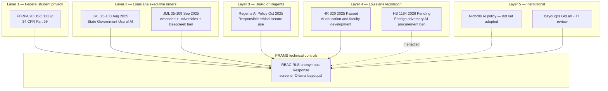
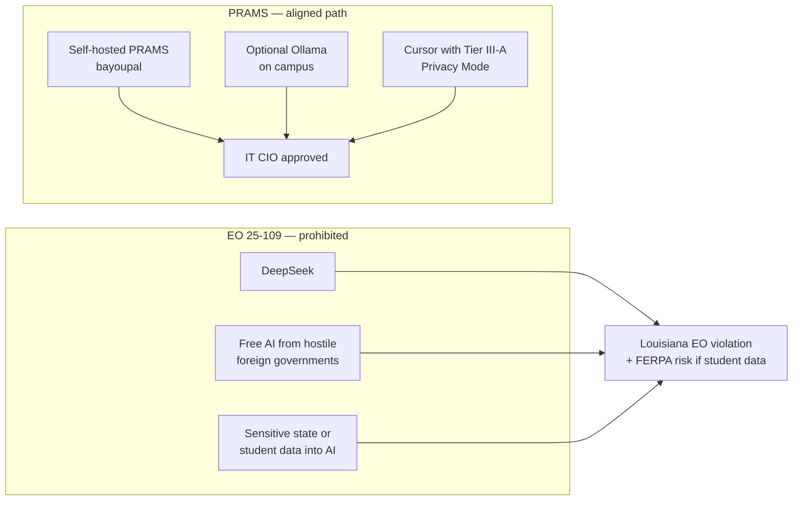
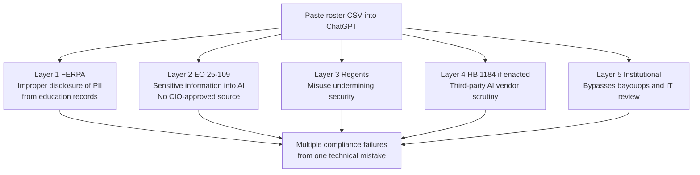

# Louisiana AI + FERPA Compliance Stack — PRAMS

**Purpose:** Layer **Louisiana executive orders, Regents policy, and state legislation** on top of **FERPA** and **technical violation paths** so deans, IT, and leadership see one integrated picture.  
**Institution:** Nicholls State University (University of Louisiana System)  
**Date:** July 2026  
**Related:** [FERPA_VIOLATION_PATHS.md](FERPA_VIOLATION_PATHS.md) | [STUDENT_DATA_TAXONOMY.md](STUDENT_DATA_TAXONOMY.md) | [NICHOLLS_AI_USE_INVENTORY.md](NICHOLLS_AI_USE_INVENTORY.md)

---

## The compliance stack (how layers fit together)

Think of PRAMS as subject to **stacked obligations**. A single action (e.g., sending a roster to ChatGPT) can violate **multiple layers at once**.

---

## Layer 1 — FERPA (federal)

| Requirement | Technical meaning for PRAMS |
|-------------|---------------------------|
| No improper disclosure of PII from **education records** | Tier II data and identifying Tier I must not leak to unauthorized parties |
| **Maintained** + **identifiable** = education record | Signup, credit, enrollment, linked prescreen |
| Enforcement via **SPPO** — not private damages suits | Document controls; complaint-driven |

**PRAMS alignment:** [FERPA_VIOLATION_PATHS.md](FERPA_VIOLATION_PATHS.md) | [STUDENT_DATA_TAXONOMY.md](STUDENT_DATA_TAXONOMY.md)

**Key technical violations:** Tier II → external LLM; IDOR on signups; linking `Response` to participant.

---

## Layer 2 — Governor’s executive orders

### JML 25-103 (August 2025) — *State Government’s Use of AI*

**Source:** [gov.louisiana.gov — EO 25-103](https://gov.louisiana.gov/assets/ExecutiveOrders/2025/JML-Exective-Order-25-103.pdf)

| Section | Requirement | PRAMS posture |
|---------|-------------|---------------|
| **§2** | No procurement/licensing of AI before **Dec 15, 2025** (pause) | PRAMS is **internally developed**, not procured SaaS AI; optional LLM APIs need **IT/CIO approval** |
| **§3** | CIO/agency head must issue **AI acquisition policy** and **information management policy** by Dec 15, 2025 | Nicholls policy **pending** — use [NICHOLLS_AI_USE_INVENTORY.md](NICHOLLS_AI_USE_INVENTORY.md) as interim inventory |
| **§4** | **Inventory** all AI contracts and use cases | Inventory doc + bayouops review |
| **§6** | **Review, analyze, cleanse** datasets before use in AI | `FERPAPromptScreener`; no Tier II in prompts; Tier III-A for dev |
| **§8** | Order remains until rescinded | Ongoing obligation |

### JML 25-109 (September 2025) — *Amended State Government’s Use of AI*

**Source:** [gov.louisiana.gov — EO 25-109](https://gov.louisiana.gov/assets/ExecutiveOrders/2025/JML-Executive-Order-25-109.pdf) | [Governor news release](https://gov.louisiana.gov/news/4960)

| Section / theme | Requirement | PRAMS posture |
|-----------------|-------------|---------------|
| **Universities as targets** | Presidents should know institutions are **nation-state targets** | Self-hosted bayoupal; no student portals with ad trackers |
| **DeepSeek / hostile foreign AI** | **No place in universities** — bans free AI tools from hostile foreign governments (CCP, DeepSeek cited) | **DeepSeek not used**; block at network layer if needed |
| **§2** | **CIO approval** before agency use of any AI source | Route PRAMS optional AI through **IT/bayouops**; default **off** |
| **§3** | Procurement pause (carried from 25-103) | External API keys = procurement decision |
| **§4** | AI acquisition + information management policies | Await Nicholls; interim inventory satisfies spirit |
| **§7** | **Dataset cleansing** before AI use | Screener + synthetic dev data + no roster paste |
| **Sensitive information** | Agencies must not input **sensitive information** into AI systems in use | **Tier II and identifying Tier I prohibited** in Cursor, external LLM |

---

## Layer 3 — Louisiana Board of Regents (October 2025)

**Source:** [Regents adopts AI policy — Oct 22, 2025](https://www.laregents.edu/news/102225release/)

| Regents requirement | PRAMS alignment |
|---------------------|---------------|
| **Prohibit misuse** of AI that undermines **data system security and integrity** | RBAC, RLS, no tracking pixels, bayouops review |
| **Encourage appropriate standards** for AI in education and research | Documented inventory; optional AI disable-able |
| **Urges systems and institutions** to create their own policies | Interim docs until UL System / Nicholls policy |
| Commissioner Reed: **cybersecurity + ethical safe use** | [FERPA_VIOLATION_PATHS.md](FERPA_VIOLATION_PATHS.md) + dean guides |

**Nicholls note:** Regents policy applies to **public postsecondary** institutions. Nicholls should adopt a **system- or campus-level** policy; until then, this stack + inventory is the defensible interim posture.

---

## Layer 4 — Louisiana legislation (selected)

| Instrument | Status | Relevance to PRAMS |
|------------|--------|-------------------|
| **[HR 320](https://www.legis.la.gov/Legis/ViewDocument.aspx?d=1422611)** (2025) | **Passed** — House resolution | Urges Regents and institutions to promote **AI education** and **faculty/staff professional development** — supports teaching *about* AI, not unchecked AI on student data |
| **HB 1184** (2026 regular session) | **Pending** — Rep. Carlson | Would prohibit **public contracts** with **foreign adversary** entities for AI technology — aligns with EO 25-109; watch if enacted |
| **~30 AI bills** (2026) | Mostly **pending** | No comprehensive LA AI statute yet; monitor [legis.la.gov](https://legis.la.gov) |

**HR 320 dean talking point:** *The Legislature wants Louisiana students to **learn** AI — not for universities to **leak** student records into unapproved AI tools.*

---

## Layer 5 — Federal AI context (adjacent, not replacing FERPA)

Louisiana EOs reference national security and call for **federal standards**. For Nicholls documentation:

| Federal reference | PRAMS relevance |
|-------------------|-----------------|
| **FERPA** | **Directly applies** — primary student-record law |
| **45 CFR 46** (Common Rule) | IRB human subjects — PRAMS audit trail |
| **FTC / consumer privacy** | Less direct; SNHU-style suits use **state + wiretap** theories |
| **NIST AI RMF** | Voluntary framework IT may reference in review |
| **Executive Order 14110** (federal AI, Biden era) | Federal agencies — **not binding** on Nicholls, but IT may cite practices |

**Do not conflate** federal AI EO with FERPA. For PRAMS, **FERPA + Louisiana EO + Regents** are the operative stack.

---

## Combined violation diagram — one action, multiple layers

**Example: Researcher pastes signup roster (Tier II) into ChatGPT**

| Technical action | FERPA | LA EO 25-109 | Regents | PRAMS control |
|------------------|-------|--------------|---------|---------------|
| Tier II → external LLM | Violation risk | Sensitive data in AI | Misuse | Screener blocks; disable external |
| DeepSeek in browser on campus | FERPA risk if student data | **EO violation** | Misuse | Not in stack; block |
| Tier II → Cursor chat | Violation risk | Sensitive data in AI | — | Policy: Tier III-A only |
| Anonymous Response on bayoupal | Generally OK | OK if no sensitive input to AI | OK | Designed path |
| Optional Ollama IRB review, IT-approved | Lower risk | CIO-approved path | OK if documented | `IRB_AI_PROVIDER=ollama` |
| PRAMS without any runtime AI | OK | **Safest EO posture** | OK | `AI_REVIEW_ENABLED=False` |

---

## PRAMS recommended posture for Louisiana + FERPA

| Setting | Recommendation | Satisfies |
|---------|----------------|-----------|
| Host on **bayoupal** only | Required | EO institutional control, Regents security |
| **bayouops GitLab** review | Required | EO inventory/approval, institutional layer |
| **DeepSeek / hostile foreign AI** | **Blocked** | EO 25-109 |
| **Runtime AI** | **Off** until Nicholls + CIO sign-off | EO §2 CIO approval |
| **External LLM APIs** | **Disabled** | FERPA + EO sensitive-data ban |
| **Cursor development** | Privacy Mode; **Tier III-A only** | EO dataset cleansing (dev) |
| **Course credit mode** | **Off** unless required | FERPA scope reduction |
| **Tier II in any LLM** | **Prohibited** | All layers |

---

## Leadership scripts (Louisiana-aware)

### 30 seconds — Dean / Dr. Young

> PRAMS follows **FERPA** for student records, **Governor Landry’s executive orders** for AI — no DeepSeek, no sensitive data in unapproved AI, IT approval — and the **Board of Regents’** call for secure, ethical AI. It’s on **bayoupal**, reviewed through **bayouops**, and we can keep production AI **turned off** until Nicholls policy catches up.

### One sentence — President / Governor optics

> PRAMS is Nicholls-controlled research infrastructure that complies with **FERPA**, **Louisiana’s AI executive orders** (no hostile foreign AI, CIO-reviewed, cleansed datasets), and **Regents policy** — with optional AI disabled by default.

---

## Document map — full stack

| Layer | Document |
|-------|----------|
| FERPA + technical violations | [FERPA_VIOLATION_PATHS.md](FERPA_VIOLATION_PATHS.md) |
| Data tiers I / II / III | [STUDENT_DATA_TAXONOMY.md](STUDENT_DATA_TAXONOMY.md) |
| AI inventory for IT/GitLab | [NICHOLLS_AI_USE_INVENTORY.md](NICHOLLS_AI_USE_INVENTORY.md) |
| Deans & chairs | [DEAN_AND_CHAIR_ONE_PAGER.md](DEAN_AND_CHAIR_ONE_PAGER.md) |
| Executive / president | [PRESIDENT_EXECUTIVE_BRIEF.md](PRESIDENT_EXECUTIVE_BRIEF.md) |
| Legal mapping | [FERPA_COMPLIANCE_MAPPING.md](FERPA_COMPLIANCE_MAPPING.md) |

---

## Checklist — bayouops / IT / Academic Affairs

- [ ] PRAMS listed in institutional **AI use case inventory** (EO §4)
- [ ] **CIO or designee** aware of optional Ollama path (EO §2)
- [ ] **DeepSeek** and hostile foreign AI **not** in dependency stack or browser policy exceptions
- [ ] **FERPA_VIOLATION_PATHS** shared with researchers — no Tier II in LLMs
- [ ] **AI_REVIEW_ENABLED=False** in production until Nicholls AI policy
- [ ] Regents resolution: campus policy development **in progress** — interim stack documented
- [ ] Monitor **HB 1184** and 2026 LA AI bills if procurement changes

---

## Source links

| Source | URL |
|--------|-----|
| EO JML 25-103 | https://gov.louisiana.gov/assets/ExecutiveOrders/2025/JML-Exective-Order-25-103.pdf |
| EO JML 25-109 | https://gov.louisiana.gov/assets/ExecutiveOrders/2025/JML-Executive-Order-25-109.pdf |
| Governor release (DeepSeek ban) | https://gov.louisiana.gov/news/4960 |
| Board of Regents AI policy | https://www.laregents.edu/news/102225release/ |
| HR 320 | https://www.legis.la.gov/Legis/ViewDocument.aspx?d=1422611 |
| HB 1184 (pending) | https://legis.la.gov/legis/ViewDocument.aspx?d=1457601 |

---

*Interim compliance stack until Nicholls and UL System adopt formal AI policy. General Counsel confirms institutional obligations.*
