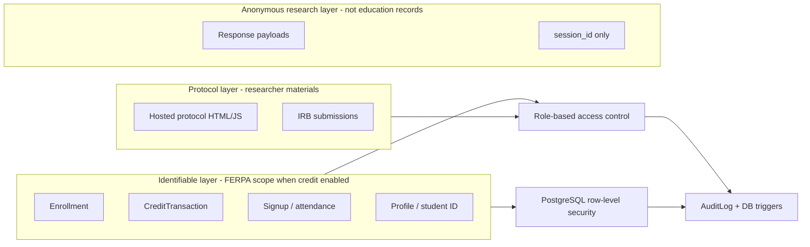

# PRAMS: Executive Brief on FERPA, AI, and Internal Security Review Readiness

**To:** University President / Executive Leadership  
**From:** PRAMS Project Lead  
**Date:** July 2026  
**Classification:** Internal — for leadership, General Counsel, CIO, and IRB review  
**Supporting detail:** [FERPA_COMPLIANCE_MAPPING.md](FERPA_COMPLIANCE_MAPPING.md) | [IT_EXECUTIVE_COMPLIANCE_SUMMARY.md](../../IT_EXECUTIVE_COMPLIANCE_SUMMARY.md)

---

## Purpose

This brief answers three questions leadership is asking:

1. **Is FERPA-and-AI anxiety justified?**
2. **Has PRAMS been built in a way that can pass internal IT and legal review?**
3. **What decisions are needed before hosting institutional research protocols and databases on PRAMS?**

---

## Executive Summary

**PRAMS (Participant Recruitment and Management System)** is an internally developed platform for IRB-compliant research recruitment, protocol hosting, and — optionally — course-credit tracking. It is designed to replace commercial systems (e.g., SONA) while keeping data under institutional control.

**Bottom line for leadership:**

| Question | Answer |
|----------|--------|
| Are universities being sued over student data? | **Yes** — but current litigation targets **tracking pixels and ed-tech analytics** (GPA, enrollment sent to Google/TikTok), not IRB protocol review AI. |
| Can students sue for FERPA damages? | **Generally no** — Supreme Court (*Gonzaga*, 2002). Enforcement is federal complaint-driven (Department of Education). |
| Is AI use in higher ed legally unsettled? | **Yes** — no formal FERPA rules on generative AI yet; institutions must apply existing law with counsel. |
| Was PRAMS built recklessly? | **No** — layered access controls, database isolation, anonymous research storage, AI prompt screening, and audit logging are in place. |
| Can it pass internal security review? | **Yes, with standard IT deployment requirements** — see Section 5 checklist. Remaining gaps are documented and remediable before production. |

**Recommended posture:** Formalize PRAMS under IT management, deploy on an internal VM with campus SSO, use **no-credit mode** unless course credit is operationally required, and route all AI review through **institutional infrastructure (Ollama)** rather than external LLM vendors.

---

## 1. What the Headlines Actually Show

Recent university litigation involves **unauthorized disclosure of identifiable student academic data to third-party analytics companies** — not generative AI protocol review.

| Case (status) | Allegation | Relevance to PRAMS |
|---------------|------------|-------------------|
| *Zeolla v. SNHU* (filed Dec 2025; early stage) | Student portal sent GPA, enrollment, financial aid to Google/TikTok via tracking tools | **High cautionary value** — illustrates FERPA narrative in court, but different fact pattern |
| UT Austin chat/LMS litigation (2025–26) | Canvas, Zoom, Teams data sharing | Ed-tech vendor disclosure risk |
| *Newby v. Adelphi* (2026) | False AI-*detection* accusation; due process | AI in academia is in court — but on **academic integrity**, not data disclosure |
| FERPA private lawsuits | Students seeking damages | **Not viable** under current Supreme Court precedent |

**What is not yet common:** Federal class actions whose core claim is *"the university sent student education records to OpenAI/Anthropic for generative AI processing."*

**What is real:** Regulatory complaint risk, reputational exposure, and the **pattern** of student-data litigation expanding from tracking pixels toward any third-party data flow — including AI if misconfigured.

---

## 2. FERPA and AI: What We Can State Conclusively

### Settled law

- A **FERPA violation** (regulatory) occurs when an institution has a **policy or practice** of disclosing **personally identifiable information from education records** without consent or a permitted exception.
- An **education record** is information **(a) directly related to an identifiable student** and **(b) maintained** by the institution.
- **Enforcement** runs through the U.S. Department of Education Student Privacy Policy Office — not private damage lawsuits.

### Unsettled / context-dependent (require General Counsel input)

- Whether specific **email communications** are education records (Department has not adopted all circuit-level holdings).
- Whether **voluntary research participation** without grade linkage is an education record (defensible reduction of scope; not Supreme-Court-tested for recruitment platforms).
- Whether sending protocol text to an **external LLM** is a FERPA "disclosure" (analyze under school-official/contractor rules; no direct AI precedent).

**Leadership framing:** FERPA caution is **appropriate**. FERPA panic based on imagined damage lawsuits over IRB AI review is **overstated**. The institution should govern AI through **policy + architecture**, not avoidance of all AI.

---

## 3. How PRAMS Protects Student Data

PRAMS separates **identifiable participation records** from **anonymous research data** by design.

### Core technical controls (implemented)

| Control | What it does |
|---------|--------------|
| **Five-role RBAC** | Admin, IRB Member, Researcher, Instructor, Participant — enforced on every sensitive route |
| **PostgreSQL RLS** | Database-level isolation: researchers see only their studies; participants see only their signups |
| **Anonymous responses** | Research payloads stored with `session_id` — **no link to participant identity** |
| **IDOR prevention** | Unauthorized access returns 404 (no information leakage) |
| **Registration lockdown** | Self-registration cannot grant admin/researcher/IRB roles |
| **Export logging** | CSV downloads of student-linked data are logged |
| **De-identified exports** | HMAC-Salted opaque IDs prevent cross-database linkage |
| **Dual audit trail** | Application `AuditLog` + immutable PostgreSQL `irb_audit_logs` triggers |
| **AI prompt screener** | Blocks high-risk prompts (student ID + academic context) to external LLM providers |
| **AI call audit** | Hash-only logging of what was sent to AI — not full prompt content externally |
| **Institutional AI path** | Ollama provider keeps IRB review on institutional infrastructure |

### Protocol hosting architecture

PRAMS hosts researcher protocols under `templates/projects/{study}/protocol/` and serves them through authenticated, IRB-gated routes. Research data submitted from protocols lands in the **`Response` table** — intentionally **decoupled** from participant accounts.

**For internal security review, the key claim is:**

> Protocol code and research databases are separable. Identifiable student administrative data (enrollment, credits, signups) lives in protected tables with RBAC and RLS. Anonymous experimental data lives in `Response` with no participant foreign key.

---

## 4. Deployment Modes: Leadership Decision

PRAMS supports two FERPA postures. **This is the single most important policy choice for the president's office.**

### Option A — Without course credit (recommended default)

| Element | Treatment |
|---------|-----------|
| Credit transactions | **Disabled** |
| Enrollment for credit | **Not used** |
| Signup / attendance | Voluntary research scheduling |
| Research payloads | Anonymous (`session_id`) |
| FERPA scope | **Greatly reduced** |

**Approved statement:**

> When course credit and grade linkage are disabled, PRAMS does not maintain academic performance records. Voluntary research participation and anonymous response payloads fall outside the core FERPA education-record definition. Baseline security controls still apply.

### Option B — With course credit (full FERPA scope)

| Element | Treatment |
|---------|-----------|
| Enrollment, credits, signups | **FERPA education records** |
| Access controls | RBAC + RLS + export logging (implemented) |
| Compliance burden | Higher — full FERPA program controls required |

**Approved statement:**

> PRAMS treats enrollment, credit transactions, signups, and profile identifiers as FERPA education records. Access is restricted by role and reinforced by database row-level security. Anonymous protocol responses remain unlinked to participant identity.

---

## 5. Internal Security Review Readiness Checklist

PRAMS is architected for **Tier-1/Tier-2 internal hosting**. The following items align with standard university IT security review expectations.

### Ready now (application layer)

- [x] Session authentication with Argon2 password hashing
- [x] RBAC on all sensitive views
- [x] CSRF protection on state-changing endpoints
- [x] Secrets via environment variables (not in source code)
- [x] Production HTTPS, secure cookies, HSTS (when `DEBUG=False`)
- [x] SQL injection mitigation (ORM throughout)
- [x] XSS mitigation (template auto-escaping)
- [x] IDOR mitigation with object-scoped queries
- [x] PostgreSQL RLS on studies and signups
- [x] IRB audit trail (application + database triggers)
- [x] FERPA AI prompt screening and hash-based AI audit logging
- [x] SSO-ready authentication backend (swap without changing authorization logic)

### Requires IT deployment (infrastructure layer)

- [ ] Host on **IT-managed VM** behind campus reverse proxy
- [ ] **TLS certificate** from institutional PKI or approved provider
- [ ] **Database encryption at rest** (PostgreSQL TDE or encrypted volume)
- [ ] **Backup and disaster recovery** per institutional policy
- [ ] **Campus SSO integration** (SAML/OIDC) — recommended before broad rollout
- [ ] **Vulnerability scanning** and patch cadence on OS/runtime
- [ ] **Log aggregation** and monitoring (SIEM-compatible)
- [ ] **Vendor review** if any external LLM provider is used (contractor/school-official analysis)

### Recommended policy before go-live

- [ ] General Counsel sign-off on FERPA posture (credit vs. no-credit mode)
- [ ] IRB acknowledgment that protocols must not collect identifiable student data in anonymous studies
- [ ] **Prohibit external LLM providers** for IRB review unless vendor agreement is in place; default to **Ollama**
- [ ] Document data retention schedule (application-level purge not yet automated — see gap below)
- [ ] Exit shadow-IT status: formal system registration with IT and data governance

### Known open gaps (documented, not hidden)

| Gap | Risk | Mitigation path |
|-----|------|-----------------|
| No automated data retention/deletion | Over-retention if breached | IT policy + future purge commands |
| IP address on anonymous responses | Theoretical re-identification | Disable or hash after 90 days |
| At-rest encryption not app-enforced | Deployment-dependent | IT infrastructure requirement |
| Study roster shows participant names to researchers | By design for scheduling | Data minimization review with IRB |

**Honest assessment:** PRAMS can pass internal security review **if** IT completes standard infrastructure controls. The application does not substitute for institutional encryption, SSO, and governance — but it does not fight against them either.

---

## 6. AI Usage: What Leadership Should Approve

PRAMS includes optional **AI-assisted IRB protocol review**. This is the area most likely to trigger presidential concern.

### Low-risk configuration (recommended)

| Setting | Value |
|---------|-------|
| AI provider | **Ollama** (on-premise or institutional server) |
| Protocol uploads | No real student names, IDs, or grades |
| IRB AI feature | Enabled for protocol metadata review only |
| External LLMs (OpenAI, Anthropic, Gemini) | **Disabled** unless General Counsel + IT approve vendor agreement |

### Higher-risk configuration (avoid without counsel)

- Sending protocol documents that contain **identifiable student data** to **external** LLM APIs
- Using AI outputs as **automated** student disciplinary or grading decisions
- Logging full AI prompts containing education records outside institutional control

**Approved AI statement:**

> PRAMS implements automated prompt screening and hash-based audit logging for IRB AI review. The institution should route AI review through Ollama when protocol materials may reference student populations. External LLM providers require vendor review under FERPA contractor provisions.

---

## 7. Comparison to Current Litigation Risk Profile

| Risk profile | Example | PRAMS posture |
|--------------|---------|---------------|
| **Tracking pixels on student portal** | SNHU lawsuit (GPA → Google/TikTok) | **Not applicable** — PRAMS does not embed third-party ad/analytics pixels on student record pages |
| **LMS vendor data sharing** | UT Austin Canvas/Zoom litigation | **Lower risk** — self-hosted; no Canvas dependency for core data |
| **AI detection false positives** | Adelphi / Newby | **Not applicable** — PRAMS does not use AI to accuse students of cheating |
| **External LLM disclosure** | Emerging concern; few reported suits | **Mitigated** — prompt screener + Ollama default + audit hashes |
| **Shadow IT / no IT oversight** | Governance failure in audits | **Addressable** — formalize under CIO before production scale |

---

## 8. Recommended Leadership Actions

| Priority | Action | Owner |
|----------|--------|-------|
| 1 | **Formalize PRAMS under IT** — exit shadow IT | CIO + Project Lead |
| 2 | **Choose deployment mode** — no-credit vs. credit | President's office + IRB + Registrar |
| 3 | **Schedule internal security review** using checklist in Section 5 | CIO |
| 4 | **General Counsel review** of FERPA mapping document | Legal |
| 5 | **Approve AI policy** — Ollama only unless vendor vetted | CIO + Legal |
| 6 | **Plan campus SSO integration** before wide participant rollout | IT |
| 7 | **Document retention policy** for research and participation data | IRB + IT |

---

## 9. One-Paragraph Briefing for the President

Universities are facing increased scrutiny over **student data leaving institutional control**, but today's lawsuits focus on **analytics companies receiving GPA and enrollment data through website tracking tools** — not on faculty using AI to review research protocols. Students generally **cannot sue for FERPA damages**; the real enforcement path is federal complaint investigation. PRAMS was built with layered defenses: role-based access, database-level isolation, **anonymous storage of research responses** (no link back to student identity), automated blocking of risky AI prompts to external vendors, and full audit logging. Hosting your own protocols on PRAMS is architecturally sound for internal security review **provided** the system is moved under IT management, deployed with standard encryption and SSO, and operated in **no-credit mode** unless course credit is truly needed. The institution should default AI review to **on-premise infrastructure** and obtain legal sign-off before enabling any external AI vendor.

---

## 10. Supporting Documentation

| Document | Audience |
|----------|----------|
| [DEAN_AND_CHAIR_GUIDE.md](DEAN_AND_CHAIR_GUIDE.md) | College deans, department heads, chairs |
| [DR_YOUNG_BRIEFING_SCRIPT.md](DR_YOUNG_BRIEFING_SCRIPT.md) | AVP Academic Affairs — 30-second script |
| [NICHOLLS_AI_USE_INVENTORY.md](NICHOLLS_AI_USE_INVENTORY.md) | bayouops / IT — AI inventory |
| [FERPA_COMPLIANCE_MAPPING.md](FERPA_COMPLIANCE_MAPPING.md) | Legal, IRB, IT — full control matrix |
| [ferpa_corpus.json](ferpa_corpus.json) | Legal — curated statute, cases, SPPO letters |
| [IT_EXECUTIVE_COMPLIANCE_SUMMARY.md](../../IT_EXECUTIVE_COMPLIANCE_SUMMARY.md) | CIO — technical security posture |
| [FERPA_AUDIT_REPORT.md](../../FERPA_AUDIT_REPORT.md) | Audit — February 2026 findings + remediation status |
| [FEDERAL_AUDIT_SURVIVAL_NO_CREDIT.md](../../FEDERAL_AUDIT_SURVIVAL_NO_CREDIT.md) | IRB — reduced-scope deployment guide |
| [IRB_AUDIT_CAPABILITIES.md](../../IRB_AUDIT_CAPABILITIES.md) | IRB — audit trail capabilities |
| [SECURITY_COMPLIANCE_REMEDIATION_LIST.md](../../SECURITY_COMPLIANCE_REMEDIATION_LIST.md) | Engineering — open remediation items |

---

*This brief supports leadership decision-making. It is not legal advice. General Counsel should review institutional FERPA posture before production deployment.*
