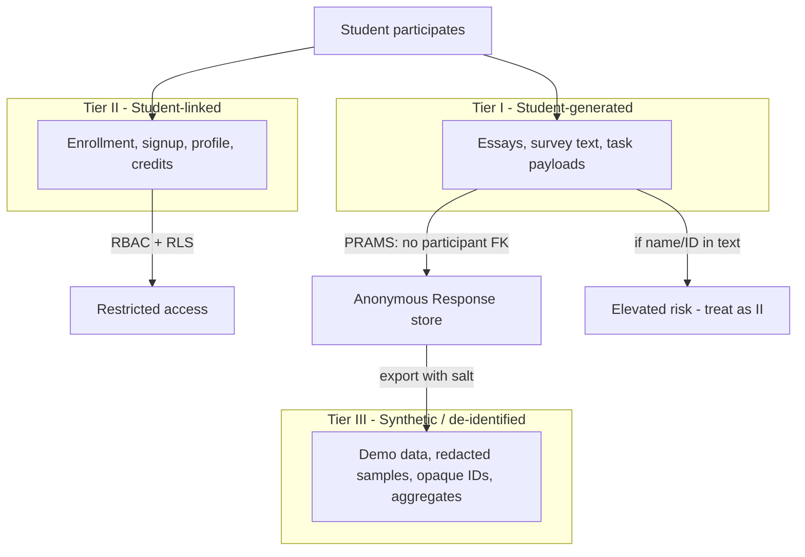

# Student Data Taxonomy for PRAMS

**Purpose:** Give deans, IRB, IT, and faculty a shared vocabulary for **what kind of data** we handle and **what protections** each tier requires.  
**Audience:** Deans, department heads, IRB, IT, project lead  
**Related:** [FERPA_COMPLIANCE_MAPPING.md](FERPA_COMPLIANCE_MAPPING.md) | [DEAN_AND_CHAIR_ONE_PAGER.md](DEAN_AND_CHAIR_ONE_PAGER.md)

---

## The three tiers

| Tier | Name | Definition | Example | Identifiable? |
|------|------|------------|---------|---------------|
| **I** | **Student-generated content** | Material a student **creates or supplies** during a study or task. May or may not contain PII depending on what they write or what the protocol collects. | Essay response, survey text, reaction-time task output, open-ended protocol answer | **Uncertain** — depends on content and context |
| **II** | **Student-linked administrative data** | Data the institution **maintains** that is **clearly tied** to an identifiable student. | Name, email, student ID, enrollment, signup/attendance, credit, prescreen linked to account | **Yes** — by design |
| **III** | **Synthetically represented data** | Data that **stands in for** real student information while **breaking or preventing** identity linkage. | Demo fixtures, redacted excerpts, HMAC export IDs, simulated responses for dev/test, aggregated statistics | **No** (if done correctly) |

---

## Tier I — Student-generated content

**What it is:** The substance of what a student produces — not the roster row that says they showed up.

**FERPA lens:** Student-generated content becomes part of an **education record** when it is (a) **directly related** to a student, (b) **maintained** by the institution, and (c) **identifiable** — whether via linkage in the database **or** self-disclosure in the text (name, email, “I’m a junior in PSYC 101,” etc.).

| Scenario | Tier | Notes |
|----------|------|-------|
| Protocol stores essay with **no** name/ID and **no** DB link to participant | I (lower risk) | PRAMS `Response` model — `session_id` only |
| Same essay but student **writes their name** in the text | I → **effective II** | Content itself creates identifiability |
| Prescreen answers stored on `PrescreenResponse` with participant FK | **II** | Linked to account |
| Researcher uploads real student essays into Cursor/ChatGPT | **II disclosure risk** | Never do this |

**Dean talking point:** *“We separate what students **write** from who they **are** — but faculty must design protocols so students aren’t asked to put their name in the answer box.”*

---

## Tier II — Student-linked administrative data

**What it is:** Records that **unambiguously** tie to an identifiable student in institutional systems.

**PRAMS examples:**

| Data element | Model | Tier |
|--------------|-------|------|
| Student ID, email, name | `User` / `Profile` | II |
| Course enrollment | `Enrollment` | II |
| Research credits | `CreditTransaction` | II |
| Signup, attendance, consent snapshot | `Signup` | II |
| Prescreen linked to participant | `PrescreenResponse` | II |

**Controls:** RBAC, PostgreSQL RLS, export logging, minimal collection, no-credit mode where possible.

**Dean talking point:** *“This is the registrar-grade stuff — who signed up, for what credit, under which ID. PRAMS locks it down the same way we’d expect for any system touching student records.”*

---

## Tier III — Synthetically represented data

**What it is:** Data engineered so that **privacy is preserved by construction** — either because it was **never real** or because **identity has been removed or obscured** beyond practical re-identification.

### Subtypes (important nuance)

| Subtype | What it is | Secure for privacy? | Valid for live research? |
|---------|------------|---------------------|-------------------------|
| **A. Fully synthetic (fabricated)** | Made-up students, lorem ipsum essays, fake IDs for demos | **Highest** — no real person | **No** — dev, training, IRB examples only |
| **B. De-identified real content** | Real student-generated text stored **without** participant FK (PRAMS `Response`) | **High** — if no PII in content and no re-ID keys | **Yes** — this is how empirical studies should run |
| **C. Pseudonymized exports** | HMAC salted opaque IDs (`get_anonymized_participant_id`) | **High** for cross-system linkage | **Yes** for analysis exports |
| **D. Redacted / excerpted** | “Student A wrote about…” with names stripped for IRB or AI review | **High** if redaction is thorough | **Yes** for review; not a substitute for raw archive |
| **E. Aggregated statistics** | “42% chose Option B” | **Highest** for disclosure | **Yes** for reporting |

### Is Tier III always “the most secure”?

**For privacy exposure: often yes — with one critical exception.**

| Use case | Best tier | Why |
|----------|-----------|-----|
| Software development & demos | **III-A** (fully synthetic) | Zero FERPA surface |
| Cursor / AI dev chat | **III-A only** | Never paste Tier I or II |
| IRB packet examples for reviewers | **III-A or III-D** | Illustrate methods without real students |
| **Running an actual study** | **I stored as III-B** | You need real responses; security = **anonymize linkage**, not fake data |
| Publishing findings | **III-E** (aggregates) or III-D | Standard research practice |
| Replacing real participant data with AI-generated “synthetic” results | **Misleading** | Not more secure — **invalid science** |

**Key insight:** Tier III-A (fully synthetic) is the most secure for **everything except collecting real research evidence**. For live studies, the winning pattern is **Tier I content stored in a Tier III-B container** — real words, no identity wire.

That is exactly what PRAMS `Response` does: student-generated payload + `session_id` + **no participant foreign key**.

---

## Recommended handling by tier

| Tier | Default PRAMS posture | Do | Don't |
|------|----------------------|-----|-------|
| **I** | Anonymous storage; protocol design minimizes self-PII | Validate protocol forms; screen payloads for obvious PII | Collect names in open responses unless IRB requires |
| **II** | RBAC + RLS; no-credit mode reduces volume | Log exports; scope researcher access | Put Tier II in AI tools or dev chat |
| **III** | Default for dev, demos, IRB illustrations | Use `PARTICIPANT_EXPORT_SALT` exports; synthetic fixtures in repo | Present synthetic results as real research data |

---

## How this maps to your “synthetic = most secure” intuition

You are **correct** for:

- Development (Cursor, testing, chair demos)
- Training new faculty on PRAMS
- Examples in dean briefings and IRB materials
- Anything sent to optional LLM IRB review

You need **nuance** for:

- **Live research:** Security comes from **de-identified Tier I** (III-B), not from fabricating Tier III-A responses
- **Essays with volunteered PII:** Tier I content can **become** as sensitive as Tier II even in an anonymous database
- **Re-identification:** Small samples, IP addresses, or unique writing can erode Tier III-B assurances

**One sentence for leadership:**

> We treat **who the student is** (Tier II) separately from **what they wrote** (Tier I), store research answers **without identity linkage**, and use **fully synthetic data** (Tier III) everywhere except actual data collection.

---

## Faculty protocol checklist (Tier I hygiene)

Before launching a study on PRAMS, confirm:

- [ ] Protocol does **not** ask for legal name, student ID, or email in the response form (unless IRB-approved and necessary)
- [ ] Instructions tell participants **not** to include identifying info in open-ended boxes
- [ ] Credit mode is **off** unless college/Registrar approved
- [ ] Demo screenshots use **Tier III-A** synthetic data only
- [ ] No Tier I or II data pasted into Cursor, ChatGPT, or external AI

---

## References in code

| Tier | PRAMS artifact |
|------|----------------|
| I (anonymous) | `Response.payload`, `Response.session_id` |
| II | `Signup`, `Enrollment`, `Profile`, `CreditTransaction`, `PrescreenResponse` |
| III-B / III-C | `config/export_utils.py` — `get_anonymized_participant_id()` |
| III-A | Demo commands, test fixtures — synthetic only |

---

*This taxonomy supports governance conversations. Tier assignment for edge cases should involve IRB and, when needed, General Counsel.*
