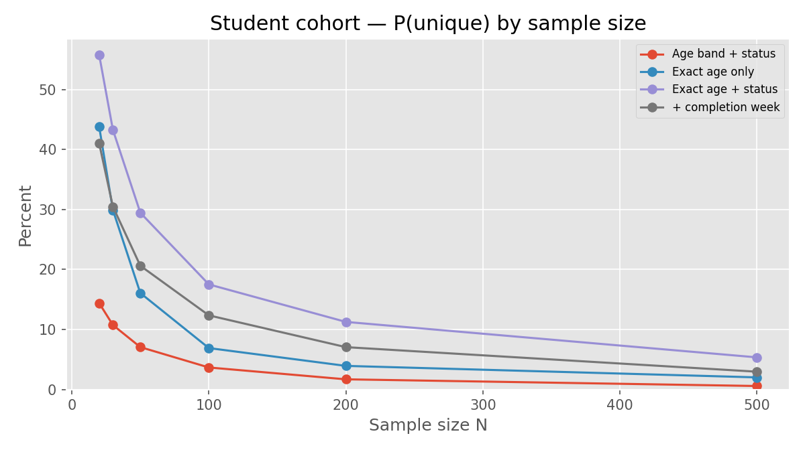
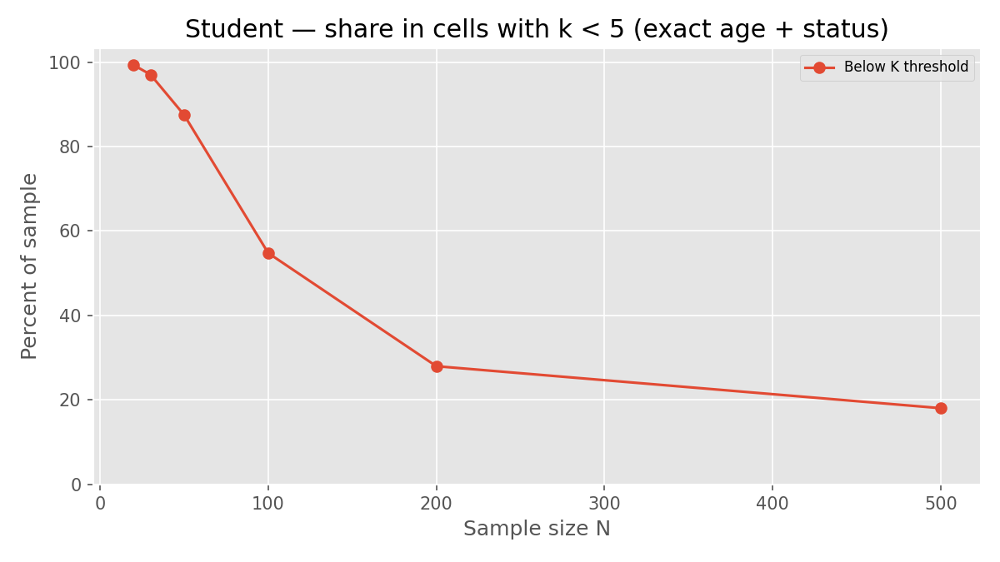
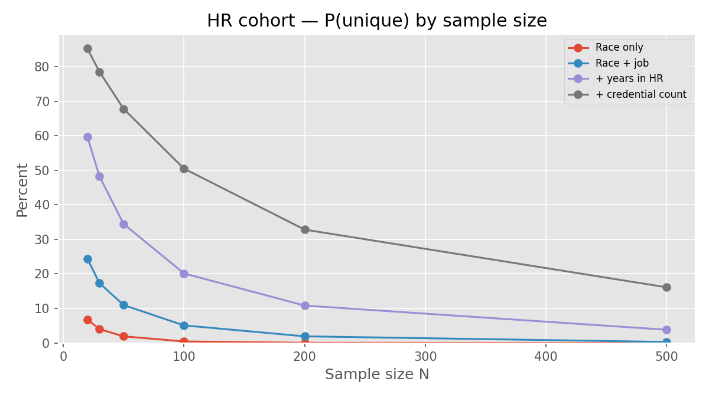
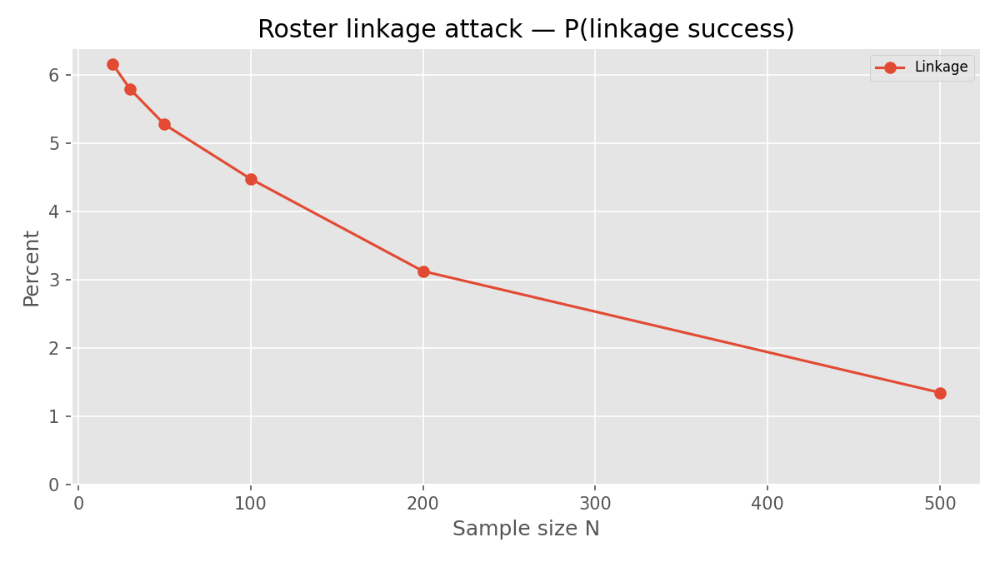
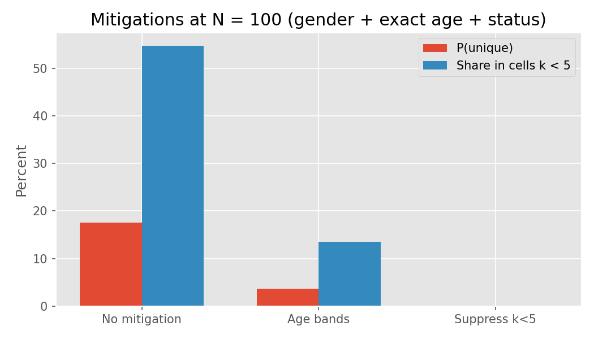

::: {.callout-note .callout-render-note collapse="true"}
## How to render (maintainers)

From the repository root (with [Quarto](https://quarto.org/) installed):

```bash
./venv312/bin/python scripts/visualize_mosaic_simulation.py
quarto render docs/mosaic_effect_technical_report.qmd
quarto render docs/mosaic_effect_technical_report.qmd --to pdf
```

Figures: `docs/figures/` · Interactive charts: [mosaic_simulation_charts.html](mosaic_simulation_charts.html)
:::

## Abbreviations

This report uses the following abbreviations:

| Abbreviation | Meaning |
|--------------|---------|
| API | Application programming interface |
| BF | Bayes factor |
| CSRF | Cross-site request forgery |
| DLP | Data loss prevention |
| DMP | Data management plan |
| DUA | Data-use agreement |
| FERPA | Family Educational Rights and Privacy Act |
| IDOR | Insecure direct object reference |
| IRB | Institutional review board |
| IT | Information technology |
| MFA | Multi-factor authentication |
| NTP | Network Time Protocol |
| OSF | Open Science Framework |
| PII | Personally identifiable information |
| QI | Quasi-identifier |
| QC | Quality control |
| RBAC | Role-based access control |
| SDC | Statistical disclosure control |
| TOP | Transparency and Openness Promotion |
| WAF | Web application firewall |

## Executive summary

The SONA / PRAMS platform collects protocol responses as flexible JSON while operating in a FERPA-aware, IRB-governed environment. For studies with sample sizes between **20 and 500**, the intended public disclosure path is **not row-level microdata** but **aggregates and inferential statistics** (means, proportions, confidence intervals, Bayes factors, and test statistics) that support scientific claims. That choice materially lowers re-identification risk, yet it does not eliminate the **mosaic effect**: the risk that a person becomes identifiable when quasi-identifiers, behavioral data, and auxiliary records (signups, emails, timing, external identifiers) are combined across systems or releases.

This report is written for two audiences who share accountability. **IT professionals** must understand where identifiers and metadata enter the stack, how exports and backups propagate them, and which access controls bound insider and pipeline risk. **Research operations** must apply **statistical disclosure control (SDC)** so that internal analysis files and any exceptional microdata handoffs do not undermine the aggregate-first publication strategy. A Monte Carlo simulation (§4.5) quantifies how often participants are unique on realistic quasi-identifiers at *N* = 20–500 and supports a practical release rule: **external handoffs should be descriptive-statistics tables unless the study is very large relative to the fields collected.** The diagrams below summarize data flow and disclosure tiers; later sections map controls to concrete models and code paths in this repository.

| Parameter | Value |
|-----------|-------|
| Typical study *N* | 20–500 |
| Primary external release | Aggregates and inferential statistics |
| Raw microdata release | Unlikely; not the default path |
| Institutional frame | FERPA-aware recruitment; IRB human subjects governance |

---

## Document standards

This report follows practices from the [K-Dense scientific-agent-skills](https://github.com/K-Dense-AI/scientific-agent-skills) collection:

| Skill | Application here |
|-------|------------------|
| **markdown-mermaid-writing** | Architecture and workflow diagrams are Mermaid in Quarto (version-controlled, diffable source) |
| **scientific-writing** | Technical prose structure, precision, and tables for comparisons (adapted for IT/research ops, not journal IMRAD) |
| **Statistical disclosure control** | *k*-anonymity framing and cell-size rules aligned with social-science aggregate release |

---

## 1. Problem statement: the mosaic effect

### 1.1 Definition

The **mosaic effect** (also discussed under **statistical disclosure control** and **record linkage** in federal and health-data guidance) arises when no single field identifies a person, but **joint information** does. In this codebase, quasi-identifiers (QIs) include demographics in JSON payloads, submission timestamps, session identifiers, vignette presentation order, and professional attributes in HR-SJT instruments. Auxiliary data may include course rosters, `Signup` timeslots, `StudyEmailContact` rows, or PRAMS `participant_secure_id` values held outside the anonymous-looking `Response` table.

Risk increases when the equivalence class size *k* for a combination of QIs falls below an acceptable threshold (*k*-anonymity). With *N* between 20 and 500, even two or three QIs can yield **singleton cells** in classroom cohorts or rare demographic intersections.

### 1.2 Aggregate release is appropriate—and not sufficient alone

Publishing group-level statistics is much safer than releasing rows, but it is not a free pass. Small cells in slides, unusual response patterns in appendices, and linkage across repeated OSF deposits can still expose people. Internal CSV/R exports are another weak spot because they often sit outside the publication workflow and get less scrutiny. Since raw release is rare in this lab, the practical focus is straightforward: keep row-level data from drifting out of the application, and apply cell-size and suppression rules to every table that leaves the secure environment.

#### Open science without mosaic risk

Open science is not an all-or-nothing obligation to post everything (Castille et al., 2022). The "buffet" framing in that editorial is useful here: preregistration, materials sharing, code sharing, and data sharing are different choices, not one package deal. For studies in the 20-500 range, the best fit is transparent design and analysis plus descriptive tables on the Open Science Framework (OSF). That keeps the work reproducible without turning internal response JSON into public microdata by accident.

| Scientific value (Castille et al., 2022) | Open-science practice | Mosaic-safe interpretation for this lab |
|------------------------------------------|----------------------|----------------------------------------|
| Openness | Preregistration, OSF project, shared materials | Document instruments and analysis; deposit **aggregates and code**, not identifiable rows |
| Honesty | Report what was collected and what is shared | Data management plan (DMP) states QIs collected; OSF README states T0-only external data |
| Stewardship | Protect participants and institutional relationships | FERPA signups stay T2; OSF gets tables with cell *n* ≥ 5, not session IDs or exact age |
| Accountability | Reproducible workflow | Code + summary tables reproduce claims; microdata stays behind DUA if needed |

OSF deposits, conference slides, and supplements are publication channels, so they need the same disclosure rules as journal tables. A preregistered hypothesis is not a reason to post a cross-tab with singleton cells. Materials can be fully open while data remain aggregate-first. That still aligns with Transparency and Openness Promotion (TOP) guideline goals, and it avoids treating "open data" as "open rows."

```{mermaid}
%%| fig-cap: Disclosure tiers and typical controls (T0 is the default external path for this lab).
flowchart TB
    t0["T0 Public aggregates<br/>means, BF, n per cell"]
    t1["T1 Restricted microdata<br/>SDC and DUA"]
    t2["T2 Operational identified<br/>FERPA signups credits"]

    t0 --> c0["Cell n at least 5<br/>no IDs or timestamps"]
    t1 --> c1["k anonymity audit<br/>metadata stripped"]
    t2 --> c2["RBAC, MFA, audit logs"]

    classDef tier fill:#dbeafe,stroke:#2563eb,color:#1e3a5f
    classDef ctrl fill:#dcfce7,stroke:#16a34a,color:#14532d
    class t0,t1,t2 tier
    class c0,c1,c2 ctrl
```

---

## 2. System architecture and data flow

### 2.1 Entity model (what IT inherits)

| Store / model | Role | Identifier posture |
|---------------|------|--------------------|
| `Response` | `payload` JSON + `session_id`, `created_at`, `ip_address`, `user_agent` | No participant FK; anonymity depends on payload |
| `Signup` | Timeslot booking linked to `User` | **Identified** (FERPA-relevant) |
| `StudyEmailContact` | Infographic email + optional `session_id` | **Bridge** to `Response` |
| `StudentDataConsent` | Secondary-use consent with email, names | **Identified** |
| `PrescreenResponse` | Participant-linked prescreen JSON | **Identified** |
| `PRAMSSignup` | `participant_secure_id`, cancellation PIN | Pseudonymous in PRAMS; may link externally |
| `AuditLog` | Actor, action, `metadata`, IP, user agent | Security and compliance |

The `Response` model is anonymous by schema design (no participant foreign key). **Client payloads and cross-table joins can restore identity** if governance is weak.

### 2.2 End-to-end flow

```{mermaid}
%%| fig-cap: Browser data flow from submission through storage, analysis export, and publication.
sequenceDiagram
    participant Br as Browser
    participant API as submit_response
    participant DB as Response table
    participant Cel as post_decision_analysis
    participant RRun as Rscript
    participant Pub as Publication OSF

    Br->>API: POST JSON payload
    API->>DB: payload session_id IP UA
    Note over DB: StudyEmailContact may link email to session_id
    Cel->>DB: read responses
    Cel->>RRun: temp CSV with ids and payload
    RRun-->>Pub: summary stats only intended
    Note over Pub: T0 aggregates no row-level release
```

**Ingestion (`apps/studies/views.py`, `submit_response`):** full client JSON is persisted without field-level allowlisting; `REMOTE_ADDR` and `HTTP_USER_AGENT` are stored (HR-SJT demographics use `get_client_ip` with `X-Forwarded-For`—proxy configuration should be consistent).

**High-risk payload fields (goals-refs live survey):** exact `demographics.age`, `demographics.gender`, `demographics.student_status`, `prams_participant_id`, `completed_at`, `results_email`, `vignette_order_presented`, `goal_frames`, client `user_agent`.

**Export (`apps/studies/tasks.py`):** `run_post_decision_analysis` writes a temporary CSV with `response_id`, `session_id`, `created_at`, and serialized `payload` for `Rscript`. The file is deleted in `finally`, but the R process or analyst environment may retain copies.

**Pseudonymization utility:** `config/export_utils.py` provides `get_anonymized_participant_id()` (HMAC with `PARTICIPANT_EXPORT_SALT`) but is **not wired** into the main response export path—IT should not assume automatic HMAC IDs on export.

### 2.3 Mosaic linkage scenarios (this system)

```{mermaid}
%%| fig-cap: Cross-table linkage paths that can re-identify anonymous-looking responses.
flowchart LR
    Resp["Response<br/>session_id created_at payload"]
    E["StudyEmailContact<br/>email session_id"]
    S["Signup<br/>user timeslot"]
    C["StudentDataConsent<br/>email name"]
    P["PRAMS secure_id<br/>in payload or URL"]

    E -->|session_id| Resp
    S -.->|time correlation| Resp
    C -.->|email match| E
    P -.->|in payload| Resp

    classDef store fill:#e0e7ff,stroke:#4f46e5,color:#312e81
    class Resp,E,S,C,P store
```

---

## 3. Key concerns for IT professionals

IT ownership centers on **confidentiality, integrity, and auditability** of systems that touch participant data—not on choosing statistical tables for papers.

### 3.1 Security and access control

| Concern | Description | Posture in this codebase |
|---------|-------------|---------------------------|
| Authentication boundary | Who may POST protocol data | `submit_response` is unauthenticated; gated by `Study.active_approved` |
| RBAC | Participant / researcher / IRB / admin | Role model present; see `SECURITY_COMPLIANCE_REMEDIATION_LIST.md` |
| IDOR | Object-level authorization | Documented remediation for attendance and similar views |
| CSRF | Cross-site POST to study APIs | Requires explicit token strategy per deployment |
| Admin surface | Django admin shows full `payload`, IP, UA | High-trust accounts only; MFA |

### 3.2 Data classification and FERPA

Enrollments, credits, signups, and prescreens linked to `User` are **education records** when maintained by the institution. `Response` rows may fall outside FERPA only while they remain **non-linkable**; linkage via email, session, or timing collapses that boundary. Secondary-use consent (`StudentDataConsent`) is a separate legal track from anonymous protocol JSON. IRB AI review may transmit protocol text to external LLMs—see `FERPA_AUDIT_REPORT.md` for prompt-screening gaps.

### 3.3 Infrastructure and pipeline leakage

| Mechanism | IT action |
|-----------|-----------|
| `ip_address`, `user_agent` on `Response` | Restrict column access; exclude from backups shared with researchers |
| Precise timestamps | Treat as QI in exports; align NTP and proxy logging |
| UUID keys in CSV/R temp files | Encrypt analyst workstations; no sync to personal cloud |
| DB backups, WAF, app logs | Retention policy; DLP on export endpoints |
| `course_credits_csv` (FERPA) | Log access (implemented); separate storage from research |

### 3.4 Monitoring and audit

`AuditLog` records sensitive actions; signal-created entries **lack IP/user agent** (`apps/studies/signals.py`). IT should centralize logs, review admin access periodically, and alert on anomalous `Response` creation rates (data poisoning).

### 3.5 What IT should expect from research (aggregate-first)

When research affirms that only **T0** outputs leave the institution, IT still validates that **T1** files are not stored on open shares. Research attestation should reference cell-size rules (§4.1) and the audit script (§5).

---

## 4. Research-side mitigation (statistical disclosure control)

Research operations implement SDC complementary to IT controls. Because external release is **aggregate-first**, the highest-impact research practices are **small-cell suppression**, **QI minimization**, and **internal microdata hygiene**.

### 4.1 Cell-size and *k* rules for *N* = 20–500

| *N* range | Minimum reported cell *n* | Internal *k* review (if microdata exists) |
|-----------|---------------------------|---------------------------------------------|
| 20–49 | 5 (collapse or suppress otherwise) | Target *k* ≥ 3–5; avoid 3+ way demos in tables |
| 50–199 | 5 | Target *k* ≥ 5 |
| 200–500 | 5 (10 for rare HR/professional categories) | Target *k* ≥ 5–10 |

For journals, OSF, and conference slides: **do not display cells with *n* < 5**. For inferential claims, report test statistics and effect sizes at the **condition or scale level**, not per-participant series, unless *n* is large and points are aggregated.

### 4.2 Collection-time mitigations

Harmonize instruments so live surveys match lower-risk patterns already used in `ext_am4_assessment.js` (age **bands**, not exact age). Route optional emails through `StudyEmailContact`, not `results_email` inside `payload`. Avoid echoing PRAMS participant IDs into JSON unless IRB-approved linkage is required; if required, store keys in a **locked linkage table**, not in analysis copies. Omit client `user_agent` and ISO `completed_at` from payload when server `created_at` suffices for operations.

### 4.3 Analysis-time mitigations

Researchers should flatten `payload` for internal QC, run the k-anonymity audit (§5), coarsen age and dates, top/bottom-code numeric outliers, apply local suppression on sparse cells, and compute inferential results inside the secure environment. **Only summary tables** graduate to T0.

### 4.4 Publication and OSF

Preregister the disclosure tier in the protocol and data management plan. Suppress interaction cells with low *n*. Do not publish vignette order vectors with demographics unless aggregated. Separate FERPA operational exports from analysis directories on storage.

```{mermaid}
%%| fig-cap: Recommended research workflow from collection through publication (aggregate-first).
flowchart TD
    c1["Protocol design<br/>minimize QIs"]
    c2["Secure analysis<br/>no IDs in notebooks"]
    c3["reid_risk_audit.py<br/>if microdata touched"]
    c4["Tables for paper<br/>cell n at least 5"]
    c5["T0 release<br/>OSF journal"]

    c1 --> c2 --> c3 --> c4 --> c5

    classDef step fill:#dbeafe,stroke:#2563eb,color:#1e3a5f
    class c1,c2,c3,c4,c5 step
```

### 4.5 Monte Carlo simulation: plain-language results

A population-level simulation (`scripts/mosaic_reidentification_simulation.py`) draws many random samples at sizes *N* = 20-500 and asks a simple question: how often does one person end up alone in a quasi-identifier cell? Here that means being the only row with a given combination such as gender, exact age, and student status. The figures label that rate as P(unique). In plain terms, it is an estimate of how easy row-level matching can become when detailed microdata exist internally, even if nobody plans to publish those rows.

How to read the charts: each line reflects a different level of detail in the collected fields. When P(unique) is high, those fields start behaving like a partial identifier. If someone already knows a student's age, gender, and status, they can often find one matching row. The second student chart tracks a different threshold: the share of participants in cells smaller than five, which is the common minimum for tables in papers and slides. The HR charts add career attributes (race, job level, years in HR, credentials), and uniqueness rises fast. The linkage chart models a partial roster attack. The mitigation bars compare three policy options at *N* = 100.

| Finding (student, gender + exact age + status, no mitigation) | Approximate value |
|---------------------------------------------------------------|-------------------|
| P(unique) at *N* = 20 | 56% |
| P(unique) at *N* = 100 | 18% |
| P(unique) at *N* = 100 after age bands | 4% |
| P(unique) at *N* = 100 after suppressing cells with *k* < 5 | 0% |
| Share of sample in cells with *k* < 5 at *N* = 100 | 55% |
| HR four-way QIs, P(unique) at *N* = 50 | 68% |
| Roster linkage success at *N* = 100 | 4–5% |

Student cohort: exact age creates a lot of uniqueness on its own at classroom sample sizes, and adding student status makes that worse. At *N* = 100, roughly one in six participants is unique on gender + exact age + status. At *N* = 20, it is more than half. Switching to age bands cuts the *N* = 100 result to about one in twenty-five. Suppression of sparse cells (or collecting less granular fields from the start) can remove singleton cells in this scenario. Even with no row-level public release, the below-*k* curve shows how easy it is for small cross-tabs to leak identity.

HR cohort: once you combine several career attributes, uniqueness climbs quickly. With four QIs at *N* = 50, about two-thirds of participants are unique. The rate drops as *N* increases, but it is still non-trivial at *N* = 500 for the richest field combination.

Linkage and mitigations: roster linkage is a secondary path compared with in-sample uniqueness, but in this simplified model it still sits around 4-5% near *N* = 100. The mitigation comparison at *N* = 100 is the practical takeaway: coarsening helps, and suppression (or tighter collection rules) can bring both P(unique) and small-cell share to zero in this case.

Full numeric output: `docs/mosaic_simulation_results.csv`. Regenerate figures with `scripts/visualize_mosaic_simulation.py`.

#### Recommended external release format

For studies in the 20-500 participant range, the safest default is simple: what leaves the secure environment should be descriptive tables (or a small set of tables), not row-level files and not high-dimensional tabs with thin cells. Inferential outputs can still be reported from secure analysis (test statistics, Bayes factors, confidence intervals). The key boundary is that external files should not be reversible to a person.

That can change when datasets are very large relative to the identifiers collected (for example, thousands of rows with coarse demographics), because row-level uniqueness drops. In this lab, that is the exception, not the norm. Operationally, treat Celery-to-R CSVs, notebook extracts, and OSF uploads as T0 summaries only. If a collaborator needs more detail, use a data-use agreement, disclosure controls, and the audit script in §5 instead of sharing raw exports by email.

::: {.callout-important}
#### Release checklist (research PI)

1. External handoff = **means, proportions, SDs, test stats, Bayes factors, cell *n***—not participant-level rows.
2. Every published cell has **n ≥ 5** (collapse or suppress otherwise).
3. No exact age, email, session ID, vignette order vectors, or timestamps in public materials.
4. Run `reid_risk_audit.py` before any exceptional microdata share when *N* < 200 or ≥3 QIs are collected.
:::

#### Simulation figures

{#fig-student-punique width=95% fig-cap="Student cohort — P(unique) by *N* (no mitigation). Higher lines mean more fields or finer age detail."}

{#fig-student-belowk width=95% fig-cap="Student cohort — fraction in cells with *k* < 5 for exact age + status."}

{#fig-hr-punique width=95% fig-cap="HR cohort — P(unique) by *N* (no mitigation)."}

{#fig-linkage width=95% fig-cap="Roster linkage — P(linkage success) for gender + exact age + status."}

{#fig-mitigation-n100 width=95% fig-cap="Mitigations at *N* = 100 — P(unique) and share in cells with *k* < 5."}

::: {.content-visible when-format="html"}
**Interactive charts:** [mosaic_simulation_charts.html](mosaic_simulation_charts.html) (same data; zoom-friendly in a browser).
:::

---

## 5. Operational tooling

Repository script: `scripts/reid_risk_audit.py` (pandas). Run after exporting responses from Django (management command or admin export), **before** any collaborator handoff or R analysis on row-level data.

```bash
# Risk report (aggregate release: still useful for internal QC)
python3 scripts/reid_risk_audit.py \
  --input responses_export.csv \
  --flatten-payload \
  --k-threshold 5 \
  --max-combo 3 \
  --strip-identifiers \
  --output-risk k_risk_report.csv \
  --output-summary-json k_risk_summary.json

# Optional sanitized microdata for T1
python3 scripts/reid_risk_audit.py \
  --input responses_export.csv \
  --flatten-payload \
  --k-threshold 5 \
  --remediate \
  --output-sanitized responses_sanitized.csv
```

| Metric | Meaning |
|--------|---------|
| `min_k` | Smallest group size for a QI combination |
| `groups_below_k` | Count of equivalence classes under threshold |
| `pct_unique_rows` | Fraction of rows in singleton classes |

Remediation patterns implemented in the script:

```python
# Coarsen age and dates; strip identifiers; suppress sparse cells
df["age_band"] = pd.cut(df["age"], bins=[18, 25, 35, 45, 55, 65, 200], right=False)
df["created_date"] = pd.to_datetime(df["created_at"], utc=True).dt.floor("D")
drop = [c for c in df.columns if any(h in c.lower() for h in
        ("email", "session_id", "ip", "user_agent", "response_id"))]
df = df.drop(columns=drop, errors="ignore")
```

---

## 6. Joint responsibility matrix

| Risk | IT primary | Research primary |
|------|------------|------------------|
| Unauthorized admin/export | RBAC, MFA, logging | Least-privilege accounts |
| PII in JSON payload | API allowlist (future); WAF | Protocol field hygiene |
| Temp CSV → R | Secure `/tmp`, container isolation | SDC before R; no raw `saveRDS` on sync folders |
| Demographics + timing mosaic | Consistent proxy IP logging | Coarsen timestamps; limit QIs |
| Email ↔ session bridge | DB permissions on `StudyEmailContact` | No merge into analysis without IRB |
| Small cells in public tables | — | Suppress; collapse categories |
| AI IRB prompts | Vendor contracts, egress | Redact uploads |

---

## 7. Gap summary and recommended actions

**Cross-functional (high priority):**

1. Payload allowlist at `submit_response` for `email`, `results_email`, `user_agent`, precise `completed_at`, and nonessential external IDs.
2. Wire export sanitization and `get_anonymized_participant_id()` on any CSV leaving Django/Celery.
3. Use `get_client_ip(request)` consistently behind reverse proxies.
4. Coarsen or audit temp CSV before `Rscript` in `run_post_decision_analysis`.

**Research (aggregate release path):**

1. Enforce **cell *n* ≥ 5** on all external tables and slides.
2. Run `reid_risk_audit.py` before submission when *N* < 200 or ≥3 QIs are collected.
3. Align goals-refs live survey with age bands and separate email collection.

**IT-only:**

1. Continue `SECURITY_COMPLIANCE_REMEDIATION_LIST.md` remediations.
2. Encrypt backups containing `Response`; periodic access reviews.
3. Monitor abnormal submission volume per study.

---

## 8. Conclusion

For studies with 20–500 participants, releasing **aggregates that support inferential claims** is the correct default and aligns with how this lab intends to communicate science externally. IT professionals should treat the application as a **high-trust data processor**: metadata, bridges, and export pipelines are the dominant mosaic vectors. Research teams should treat **every internal CSV as if it could become public**, applying SDC and cell-size discipline before analysis artifacts spread beyond the secure environment. Mermaid diagrams and the audit script in this repository are maintained as **version-controlled source** so IT and research can update controls as protocols evolve.

---

## Appendix A — Quasi-identifier inventory

| Source | Fields |
|--------|--------|
| `Response` columns | `session_id`, `created_at`, `ip_address`, `user_agent` |
| goals-refs payload | `demographics.*`, `prams_participant_id`, `completed_at`, `vignette_order_presented`, `goal_frames`, `results_email` |
| EXT-AM4 payload | `session_id`, `started_at`, `completed_at`, `demographics.age_range`, `demographics.gender`, `condition` |
| HR-SJT payload | `race_ethnicity`, `job_level`, `years_in_hr`, `education`, `credentials` |
| Linkage | `StudyEmailContact.email` + `session_id`; `StudentDataConsent.email` |

## Appendix B — IT operations checklist (one page)

Use this checklist for onboarding, annual review, or pre-production sign-off. Items map to §7 and codebase paths in this repository.

| # | Control area | Action | Owner | Done |
|---|--------------|--------|-------|:----:|
| 1 | **Access** | Restrict Django admin to named staff; require MFA for admin and DB access | IT | ☐ |
| 2 | **Access** | Verify RBAC: participants cannot self-assign `researcher` / `admin` / `irb_member` (see `SECURITY_COMPLIANCE_REMEDIATION_LIST.md` H-1) | IT | ☐ |
| 3 | **Access** | Confirm IDOR fixes on researcher views (e.g. mark-attendance) return 404, not partial PII | IT | ☐ |
| 4 | **API** | Document CSRF/token policy for `submit_response` and public protocol POST endpoints | IT | ☐ |
| 5 | **API** | Confirm only `Study.active_approved` studies accept submissions | IT / Dev | ☐ |
| 6 | **Network** | Standardize client IP: `get_client_ip(request)` on all response writes behind reverse proxy | Dev | ☐ |
| 7 | **Data store** | Encrypt DB backups containing `responses`, `signups`, `study_email_contacts` | IT | ☐ |
| 8 | **Data store** | Separate backup/ACL policy for FERPA exports (`course_credits_csv`) vs research tables | IT | ☐ |
| 9 | **Export pipeline** | Review Celery `run_post_decision_analysis`: temp CSV lifecycle, R host isolation, no shared sync folders | IT | ☐ |
| 10 | **Export pipeline** | Plan: sanitize CSV (strip `session_id`, IP, raw payload) or run `reid_risk_audit.py --remediate` before `Rscript` | Dev / Research | ☐ |
| 11 | **Linkage** | Limit DB/user access to `StudyEmailContact` and `StudentDataConsent`; audit cross-table queries | IT | ☐ |
| 12 | **Logging** | Centralize `AuditLog` + app logs; retention policy; alert on bulk CSV export / credit export | IT | ☐ |
| 13 | **Logging** | Pass `ip_address` / `user_agent` into view-created `AuditLog` rows (signals lack request context) | Dev | ☐ |
| 14 | **Third party** | IRB AI: BAA/DPAs, egress rules, prompt screening per `FERPA_AUDIT_REPORT.md` | IT / IRB | ☐ |
| 15 | **Monitoring** | Alert on abnormal `Response` create rate per `study_id` (possible poisoning) | IT | ☐ |
| 16 | **Research attestation** | Confirm lab policy: external release = T0 aggregates only; cell *n* ≥ 5 | Research PI | ☐ |
| 17 | **Incident** | Define procedure if microdata CSV is emailed or uploaded to non-approved storage | IT / IRB | ☐ |

**Sign-off (optional):** System owner _______________ Date __________ | Security/IT reviewer _______________ Date __________

## Appendix C — Document control

| Version | Date | Notes |
|---------|------|-------|
| 1.0 | 2026-05-16 | Initial report; *N* = 20–500; aggregate-primary release |
| 1.1 | 2026-05-16 | K-Dense Mermaid integration; Jupyter-free Quarto render |
| 1.2 | 2026-05-16 | Appendix B IT one-page checklist |
| 1.3 | 2026-05-16 | §4.5 simulation narrative, figures, descriptive-table release policy |
| 1.4 | 2026-05-16 | Mermaid `%%|` fig-cap fix; §1.2 open science (Castille et al., 2022) |
| 1.5 | 2026-05-16 | HTML theme (`mosaic-report.scss`); TOC/numbering cleanup |

## References

- Castille, C. M., Kreamer, L. M., Albritton, B. H., Banks, G. C., & Rogelberg, S. G. (2022). The open science challenge: Adopt one practice that enacts widely shared values. *Journal of Business and Psychology*, *37*(3), 459–467. <https://doi.org/10.1007/s10869-022-09806-2>
- K-Dense AI. (2026). *Scientific agent skills* (markdown-mermaid-writing, scientific-writing). <https://github.com/K-Dense-AI/scientific-agent-skills>
- National Institute of Standards and Technology. *Guide to protecting the confidentiality of PII* (NIST SP 800-122; see also NIST Privacy Framework). <https://www.nist.gov/privacy-framework>
- U.S. Department of Health and Human Services. (2012). *Guidance on de-identification under the HIPAA Privacy Rule*. <https://www.hhs.gov/hipaa/for-professionals/privacy/special-topics/de-identification/index.html>
